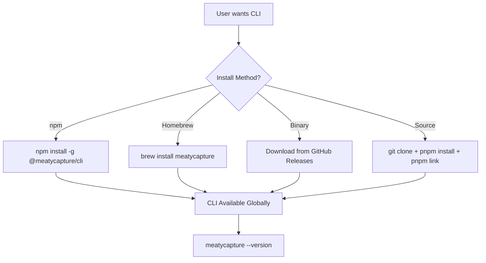

# Feature Brief & Metadata

**Feature Name:**

> CLI Distribution & Packaging

**Filepath Name:**

> `cli-distribution-v1`

**Date:**

> 2026-01-18

**Author:**

> Planning Skill

**Related Epic(s)/PRD ID(s):**

> CLI-v1, MeatyCapture MVP

**Related Documents:**

> - [CLI v1 PRD](/docs/project_plans/PRDs/features/cli-v1.md)
> - [CLI v1 Implementation Plan](/docs/project_plans/implementation_plans/features/cli-v1.md)
> - Current build-cli.js (esbuild bundler)

---

## 1. Executive Summary

MeatyCapture requires persistent CLI availability without manual `npm link` after restarts. This PRD defines a comprehensive distribution strategy enabling installation via npm global, Homebrew, GitHub Releases (standalone binaries), and proper packaging separation between CLI, web, and desktop (Tauri) components.

**Priority:** HIGH

**Key Outcomes:**
- Outcome 1: CLI installable globally via `npm install -g @meatycapture/cli` or `brew install meatycapture`
- Outcome 2: Standalone binaries available via GitHub Releases (no Node.js required)
- Outcome 3: Clear separation and versioning strategy for CLI, web, and desktop packages

---

## 2. Context & Background

### Current State

- CLI implemented at `src/cli/` using Commander.js
- Build via custom `build-cli.js` script using esbuild
- Output: `dist/cli/index.js` (ESM bundle)
- package.json bin field: `"meatycapture": "./dist/cli/index.js"`
- Requires `npm link` after every rebuild or system restart
- No npm publishing configuration
- Tauri desktop config exists but not fully integrated
- Web app builds via Vite to `dist/`

### Problem Space

Developers must run `npm link` after:
- Computer restarts (symlink lost)
- Package rebuilds (dist/cli/index.js regenerated)
- Fresh clones (no symlink exists)

This friction disrupts workflow and prevents sharing the CLI with others.

### Current Alternatives / Workarounds

1. **npm link** - Manual, ephemeral, requires rebuild awareness
2. **Direct invocation** - `node dist/cli/index.js` - verbose, requires path knowledge
3. **Shell alias** - Fragile, requires manual setup per machine
4. **npm pack + install** - Manual, no auto-updates

All workarounds are inadequate for production use or sharing.

### Architectural Context

```
┌─────────────────────────────────────────────────────────────────┐
│                        Shared Core                              │
│  src/core/           Models, validation, serializer, ports      │
│  src/adapters/       File system, config adapters               │
└─────────────────┬──────────────────────────────┬────────────────┘
                  │                              │
    ┌─────────────▼────────────┐   ┌─────────────▼────────────────┐
    │      CLI (Node.js)       │   │     Web UI (Vite+React)      │
    │  @meatycapture/cli       │   │  @meatycapture/web           │
    │  - Standalone package    │   │  - Static hosting            │
    │  - npm/brew/binary       │   │  - Vercel/Netlify deploy     │
    └──────────────────────────┘   └──────────────┬───────────────┘
                                                  │
                                   ┌──────────────▼───────────────┐
                                   │     Tauri Desktop App        │
                                   │  @meatycapture/desktop       │
                                   │  - GitHub Releases           │
                                   │  - Auto-update via Tauri     │
                                   └──────────────────────────────┘
```

---

## 3. Problem Statement

**User Story Format:**
> "As a developer, when I restart my computer or rebuild the app, I must re-run `npm link` instead of the CLI being persistently available globally."

**Technical Root Cause:**
- No npm publishing configuration in package.json
- CLI not packaged as standalone distributable
- No CI/CD automation for releases
- No Homebrew formula exists
- Monorepo structure without workspace publishing setup

---

## 4. Goals & Success Metrics

### Primary Goals

**Goal 1: npm Global Install**
- `npm install -g @meatycapture/cli` works out of the box
- CLI persists across rebuilds and restarts
- Automatic version updates via npm

**Goal 2: Homebrew Distribution**
- `brew install meatycapture` for macOS/Linux
- Formula auto-updates with releases
- Proper dependency handling

**Goal 3: Standalone Binaries**
- GitHub Releases with pre-built binaries
- No Node.js installation required
- Cross-platform: macOS (arm64, x64), Linux (x64), Windows (x64)

**Goal 4: Package Separation Strategy**
- Clear boundaries between CLI, web, desktop
- Independent versioning and release cycles
- Shared core remains internal dependency

### Success Metrics

| Metric | Baseline | Target | Measurement Method |
|--------|----------|--------|-------------------|
| CLI Installation Time | Manual (5+ min) | < 30 seconds | User testing |
| Post-restart availability | 0% (requires npm link) | 100% | Functional test |
| Supported install methods | 1 (npm link) | 4 (npm, brew, binary, source) | Release count |
| Cross-platform binaries | 0 | 5 (mac-arm64, mac-x64, linux-x64, linux-arm64, win-x64) | Release artifacts |

---

## 5. User Personas & Journeys

### Personas

**Primary Persona: Developer User**
- Role: Software developer using MeatyCapture for request logging
- Needs: Quick CLI installation, works after restart, easy updates
- Pain Points: Manual npm link, no global availability

**Secondary Persona: Team Lead / Shared Tooling**
- Role: Distributes tooling to team members
- Needs: Simple install instructions, cross-platform support
- Pain Points: Cannot share CLI without complex setup

### High-level Flow



---

## 6. Requirements

### 6.1 Functional Requirements

| ID | Requirement | Priority | Notes |
| :-: | ----------- | :------: | ----- |
| FR-1 | npm publish to @meatycapture/cli | Must | Scoped package, ESM |
| FR-2 | Standalone binaries via pkg or bun compile | Must | No Node.js required |
| FR-3 | GitHub Releases automation | Must | Triggered on version tags |
| FR-4 | Homebrew formula | Should | Tap or core formula |
| FR-5 | Monorepo workspace structure | Should | pnpm workspaces |
| FR-6 | Semantic versioning | Must | Automated via changesets or similar |
| FR-7 | Cross-platform CI matrix | Must | Build for all targets |
| FR-8 | Auto-update mechanism for binaries | Could | Self-update command |

### 6.2 Non-Functional Requirements

**Performance:**
- CLI startup time < 200ms
- Binary size < 50MB per platform

**Security:**
- Signed binaries (macOS notarization, Windows code signing)
- npm 2FA for publishing
- GitHub Release attestations

**Reliability:**
- CI/CD must pass all tests before release
- Rollback strategy for failed releases
- Version pinning support

**Observability:**
- Release notes auto-generated from commits
- Download metrics via GitHub Insights

---

## 7. Scope

### In Scope

- npm publishing configuration and CI workflow
- Standalone binary generation (pkg, bun compile, or esbuild + sea)
- GitHub Actions release workflow
- Homebrew formula creation
- Monorepo restructure if needed
- Version management and changelog automation

### Out of Scope

- Windows Store / Microsoft Store distribution
- macOS App Store distribution (desktop only, not CLI)
- Linux package managers beyond Homebrew (apt, yum, etc.) - future
- Docker image distribution - future
- Self-hosted npm registry

---

## 8. Dependencies & Assumptions

### External Dependencies

- **GitHub Actions**: CI/CD platform
- **npm registry**: Package publishing
- **Homebrew**: macOS/Linux package manager
- **pkg/Bun**: Binary compilation (TBD which tool)

### Internal Dependencies

- **CLI v1 completion**: CLI must be feature-complete
- **Test coverage**: All CLI commands must have tests
- **Version stability**: No breaking changes during release setup

### Assumptions

- npm organization `@meatycapture` available or alternative chosen
- macOS code signing certificate available (or skip for initial)
- Homebrew tap acceptable (vs core formula)

---

## 9. Risks & Mitigations

| Risk | Impact | Likelihood | Mitigation |
| ----- | :----: | :--------: | ---------- |
| npm scope unavailable | Medium | Low | Use alternative scope or unscoped name |
| Binary size too large | Low | Medium | Tree-shake, use bun compile over pkg |
| Code signing complexity | Medium | Medium | Start unsigned, add later |
| Homebrew formula rejected | Low | Low | Self-host tap first |
| Breaking changes during transition | High | Medium | Feature freeze during setup |

---

## 10. Target State (Post-Implementation)

**User Experience:**
- Run `brew install meatycapture` or `npm i -g @meatycapture/cli`
- CLI immediately available as `meatycapture` command
- Persists across restarts, updates via standard tools
- Version check: `meatycapture --version`

**Technical Architecture:**
```
packages/
├── cli/                    # @meatycapture/cli
│   ├── package.json        # Publishable, bin config
│   ├── src/                # CLI source
│   └── dist/               # Built CLI
├── core/                   # @meatycapture/core (internal)
│   ├── package.json        # Internal dependency
│   └── src/                # Shared core
├── web/                    # @meatycapture/web (or static deploy)
│   └── ...
└── desktop/                # Tauri app (if separate)
    └── src-tauri/
```

**CI/CD Flow:**
```
Tag v1.0.0 → GitHub Actions →
  ├── npm publish @meatycapture/cli
  ├── Build binaries (5 platforms)
  ├── Create GitHub Release with assets
  └── Update Homebrew formula
```

---

## 11. Overall Acceptance Criteria (Definition of Done)

### Functional Acceptance

- [ ] `npm install -g @meatycapture/cli` installs working CLI
- [ ] `brew install meatycapture` installs working CLI (via tap)
- [ ] GitHub Releases contain binaries for mac-arm64, mac-x64, linux-x64, win-x64
- [ ] Binaries execute without Node.js installed
- [ ] `meatycapture --version` shows correct version
- [ ] CLI persists after computer restart

### Technical Acceptance

- [ ] CI/CD workflow triggered on version tags
- [ ] Semantic versioning enforced
- [ ] Changelog auto-generated
- [ ] All tests pass before release
- [ ] Binary size < 50MB per platform

### Quality Acceptance

- [ ] Installation instructions documented
- [ ] Troubleshooting guide for common issues
- [ ] Uninstall instructions provided
- [ ] Version migration notes for breaking changes

---

## 12. Assumptions & Open Questions

### Assumptions

- pnpm workspaces appropriate for monorepo structure
- Bun compile preferred over pkg for binary generation
- Homebrew tap acceptable (meatycapture/tap)
- npm 2FA can be automated via CI tokens

### Open Questions

- [ ] **Q1**: Which binary bundler: pkg, bun compile, or Node.js SEA?
  - **A**: Recommend Bun compile for smaller binaries and simplicity
- [ ] **Q2**: Should web and desktop be separate packages or deploy artifacts?
  - **A**: Web = deploy artifact (Vercel), Desktop = separate GitHub Release
- [ ] **Q3**: npm scope availability - @meatycapture or alternative?
  - **A**: TBD - check npm registry
- [ ] **Q4**: Code signing priority for initial release?
  - **A**: Recommend skip for MVP, add in v1.1

---

## 13. Appendices & References

### Related Documentation

- [npm publishing guide](https://docs.npmjs.com/packages-and-modules/contributing-packages-to-the-registry)
- [Bun compile docs](https://bun.sh/docs/bundler/executables)
- [Homebrew formula cookbook](https://docs.brew.sh/Formula-Cookbook)
- [GitHub Actions release workflow](https://docs.github.com/en/actions/publishing-packages)
- [Tauri distribution](https://tauri.app/distribute/)

### Prior Art

- [Biome](https://github.com/biomejs/biome) - Rust CLI with multiple install methods
- [Volta](https://volta.sh/) - Node toolchain manager with binary distribution
- [fnm](https://github.com/Schniz/fnm) - Fast Node manager with Homebrew + binaries

---

## Implementation

### Phased Approach

**Phase 1: npm Publishing Foundation**
- Restructure for publishable CLI package
- Configure package.json exports/bin/files
- Create npm publish workflow
- Setup changesets for versioning

**Phase 2: Standalone Binaries**
- Evaluate and select binary bundler
- Create cross-platform build matrix
- Generate binaries for 5 targets
- Integrate into release workflow

**Phase 3: GitHub Releases**
- Automate release creation on tags
- Attach binary artifacts
- Auto-generate release notes
- Add installation instructions to README

**Phase 4: Homebrew Distribution**
- Create Homebrew tap repository
- Write formula for CLI
- Automate formula updates on release
- Test installation flow

**Phase 5: Desktop/Web Packaging (Deferred)**
- Tauri release automation
- Web deployment pipeline
- Version coordination strategy

### Epics & User Stories Backlog

| Story ID | Short Name | Description | Acceptance Criteria | Estimate |
|----------|-----------|-------------|-------------------|----------|
| DIST-001 | npm package config | Configure package.json for publishing | npm pack produces valid tarball | 2 pts |
| DIST-002 | Changesets setup | Add changesets for version management | `pnpm changeset` works | 1 pt |
| DIST-003 | npm publish workflow | GitHub Action for npm publish | Auto-publishes on tag | 3 pts |
| DIST-004 | Binary bundler eval | Evaluate pkg vs bun compile vs SEA | Recommendation documented | 2 pts |
| DIST-005 | Binary build matrix | Cross-platform binary builds | 5 binaries generated | 3 pts |
| DIST-006 | GitHub Release action | Automate release + assets | Release created with binaries | 3 pts |
| DIST-007 | Homebrew tap | Create tap and formula | `brew install` works | 3 pts |
| DIST-008 | Installation docs | Document all install methods | README updated | 2 pts |

---

## Required Skillsets & Agents

This feature requires specialized agents not commonly used in typical frontend/backend work:

### Primary Agents

| Agent | Role | Tasks |
|-------|------|-------|
| **devops-architect** | CI/CD infrastructure | GitHub Actions workflows, release automation |
| **backend-typescript-architect** | Package structure | Monorepo setup, package.json config, exports |
| **documentation-writer** | User documentation | Installation guides, troubleshooting |

### Specialized Agents (May Need Creation)

| Agent Need | Capability Gap | Recommendation |
|------------|---------------|----------------|
| **npm-publishing-expert** | npm registry, scopes, publishing best practices | Create specialized agent or use devops-architect |
| **homebrew-formula-expert** | Ruby DSL, Homebrew conventions, tap management | Create specialized agent or use documentation |
| **binary-bundling-expert** | pkg, bun compile, Node.js SEA comparison | Use backend-typescript-architect with docs |

### Existing Agents by Phase

**Phase 1 - npm Publishing:**
- `backend-typescript-architect` - package.json, exports config
- `devops-architect` - GitHub Actions npm publish workflow

**Phase 2 - Binaries:**
- `backend-typescript-architect` - bundler evaluation and setup
- `devops-architect` - build matrix CI configuration

**Phase 3 - GitHub Releases:**
- `devops-architect` - release workflow automation
- `changelog-generator` - release notes

**Phase 4 - Homebrew:**
- `documentation-writer` - formula creation (follows Ruby template)
- `devops-architect` - tap repository setup

**Phase 5 - Desktop/Web:**
- `devops-architect` - Tauri release automation
- `frontend-developer` - web deployment pipeline

### Skills to Leverage

| Skill | Purpose |
|-------|---------|
| `/artifacts:post-implementation-updates` | Update repo artifacts after changes |
| `/test:write-tests` | Add tests for CLI installation verification |
| `/review:code-review` | Review CI workflow configurations |

---

**Progress Tracking:**

See progress tracking: `.claude/progress/cli-distribution/all-phases-progress.md`

---

**PRD Version**: 1.0
**Last Updated**: 2026-01-18
