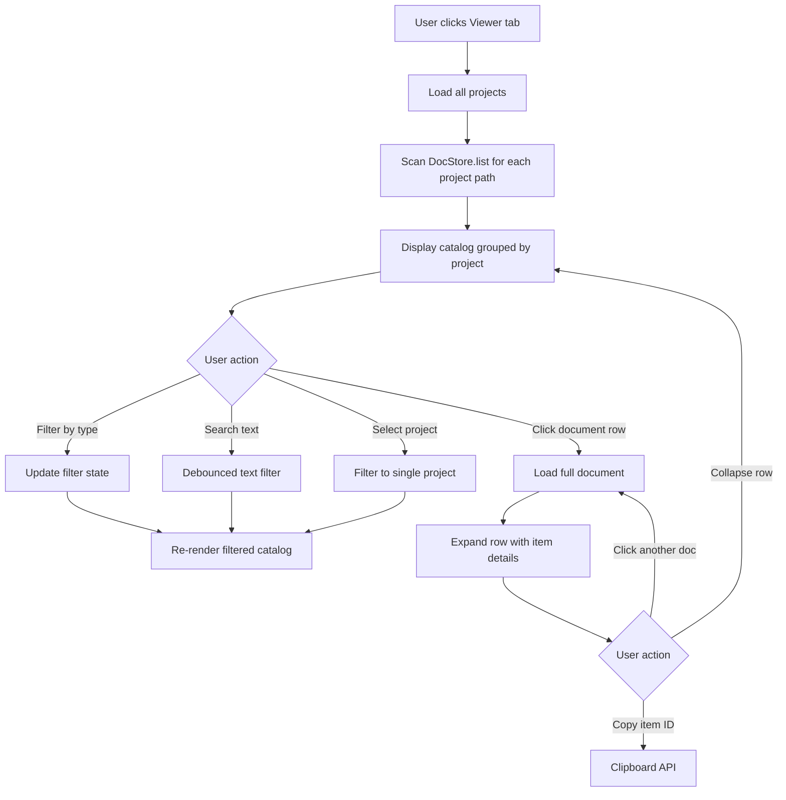

# Feature Brief & Metadata

**Feature Name:**

> Request Log Viewer

**Filepath Name:**

> `request-log-viewer-v1`

**Date:**

> 2025-12-16

**Author:**

> PRD Writer Agent

**Related Epic(s)/PRD ID(s):**

> MVP-VIEWER-001

**Related Documents:**

> - [SPIKE: Request Log Viewer](../../SPIKEs/request-log-viewer-spike.md)
> - [MeatyCapture PRD](../../initialization/prd.md)
> - [Design Spec](../../initialization/design-spec.md)
> - [DocStore Port Interface](../../../../src/core/ports/index.ts)

---

## 1. Executive Summary

Add a viewer tab to MeatyCapture (web and Tauri apps) that allows users to browse, filter, and read their existing request log markdown files. The viewer displays all request logs grouped by project with multi-criteria filtering (type, domain, priority, status, tags, text search) and on-demand document detail viewing with markdown rendering.

**Priority:** HIGH

**Key Outcomes:**
- Outcome 1: Users can discover and read any request log within 3 clicks
- Outcome 2: Filter operations complete in <100ms for 500 documents, enabling fast catalog navigation
- Outcome 3: Zero accessibility violations (WCAG 2.1 AA compliance) with full keyboard navigation

---

## 2. Context & Background

### Current State

MeatyCapture currently provides a wizard-based capture flow for creating and appending items to request-log markdown files. Users can create new projects, manage field catalogs in an admin view, and capture structured data efficiently.

**What exists today:**
- Capture wizard (Project → Doc → Item Details → Review)
- Admin field manager (global + project-level catalogs)
- Tab-based navigation: Capture | Admin
- Support for web (browser storage), Tauri (filesystem), and server-side storage

**What is missing:**
- No way to view previously created request logs
- No catalog of existing documents
- Users must navigate filesystem manually to read documents
- No filtering or search across documents
- Cannot see aggregated tags, item counts, or last updated dates

### Problem Space

After using MeatyCapture to create multiple request log documents across several projects, users lose track of:
- What documents exist and where they are stored
- Which documents contain specific types of items (bugs vs enhancements)
- When documents were last updated
- What tags are being used across documents
- How many items are in each document

**Pain points:**
1. Users must remember file paths or browse filesystem manually
2. No overview of all captured data
3. Cannot filter by type, domain, priority, status, or tags
4. Cannot search for documents by title or ID
5. Difficult to maintain awareness of captured items over time

### Current Alternatives / Workarounds

**Manual filesystem browsing:**
- Users open file explorer and navigate to `~/.meatycapture/projects/<project>/`
- Open markdown files in text editor or IDE
- Search files manually using grep or IDE search
- Limitations: Slow, error-prone, no structured filtering

**Grep/ripgrep search:**
- Terminal-based text search across markdown files
- Can find content but no UI for browsing metadata
- Limitations: Not accessible to non-technical users, no grouping by project

**Markdown preview in IDE:**
- Open files in VS Code or other IDE with markdown preview
- Navigate between files manually
- Limitations: No filtering, no catalog view, requires IDE setup

None of these alternatives provide:
- Project-grouped catalog view
- Structured metadata filtering
- Quick document preview
- Tag-based search
- Integrated UI within MeatyCapture app

### Architectural Context

MeatyCapture follows a port/adapter architecture with headless core logic:

**Layered Architecture:**
- **UI Layer** - React components (wizard, admin, shared)
- **Core Layer** - Domain models, validation, serialization, catalog logic
- **Ports** - Interfaces for DocStore, ProjectStore, FieldCatalogStore
- **Adapters** - Platform-specific implementations (browser-storage, api-client, fs-local)

**Viewer Integration Points:**
- Uses existing `DocStore.list()` to scan directories for request-log files
- Uses existing `DocStore.read()` to load full document content
- Uses existing `ProjectStore.list()` for project filtering
- Adds new headless catalog module `@core/catalog` for filtering/grouping logic
- Shares code 100% between web and Tauri platforms via adapter pattern

**No backend changes required** - Viewer is read-only using existing port operations.

---

## 3. Problem Statement

Users cannot efficiently discover, browse, or search their existing request log documents within MeatyCapture.

**User Story Format:**
> "As a product manager, when I want to review all bugs logged across my projects, I have to manually open multiple markdown files in a text editor instead of seeing a filterable catalog view with metadata like last updated date, item count, and tags."

**Technical Root Cause:**
- No UI component for catalog view exists
- No catalog filtering logic in core layer
- Tab navigation only supports Capture and Admin views
- DocStore interface supports list/read but no catalog-specific queries

**Files involved:**
- `src/ui/App.tsx` - Tab navigation needs "Viewer" option
- `src/core/catalog/` - NEW: Filtering and grouping logic (headless)
- `src/ui/viewer/` - NEW: Viewer components (catalog, filters, detail view)
- `src/core/ports/index.ts` - Existing DocStore interface (no changes)

---

## 4. Goals & Success Metrics

### Primary Goals

**Goal 1: Catalog Discovery**
- Display all request-log documents grouped by project
- Show key metadata: doc_id, title, item_count, updated_at, tags
- Collapsible project sections for organization
- Success criteria: Users can see all documents within 1 click of opening Viewer tab

**Goal 2: Multi-Criteria Filtering**
- Filter by project, type, domain, priority, status, tags
- Text search by document title or doc_id
- Combine multiple filters (AND logic between criteria, OR within arrays)
- Success criteria: Filter operations complete in <100ms for 500 documents

**Goal 3: Document Detail View**
- Click document row to expand/view full content
- Display items_index for quick scanning
- Markdown rendering for item notes
- Copy item IDs to clipboard
- Success criteria: Document detail loads in <500ms

**Goal 4: Accessibility & UX**
- WCAG 2.1 AA compliance
- Keyboard-only navigation support
- Smooth transitions matching wizard aesthetic
- Glass/x-morphism styling consistency
- Success criteria: Zero axe-core violations, full keyboard nav

### Success Metrics

| Metric | Baseline | Target | Measurement Method |
|--------|----------|--------|-------------------|
| Time to find document | N/A (no viewer) | <10 seconds | User testing |
| Filter operation latency | N/A | <100ms for 500 docs | Performance testing |
| Document load time | N/A | <500ms | Performance testing |
| Accessibility violations | N/A | 0 (axe-core) | Automated testing |
| Keyboard navigation coverage | N/A | 100% | Manual testing |
| Bundle size impact | 0 KB | <50 KB gzipped | Bundle analyzer |
| Code parity web/Tauri | 100% | 100% | Code review |

---

## 5. User Personas & Journeys

### Personas

**Primary Persona: Product Manager**
- Role: Tracks enhancements, bugs, and ideas across multiple projects
- Needs: Quick overview of all captured items, filter by type and priority, review recent additions
- Pain Points: Loses track of what was captured weeks ago, cannot quickly find specific documents

**Secondary Persona: Engineer**
- Role: Logs bugs and technical tasks, reviews backlog periodically
- Needs: Search by tags, filter by domain (api, web, infra), view item counts per project
- Pain Points: Cannot see aggregated view of bugs across projects, manual filesystem navigation is slow

**Tertiary Persona: AI Agent**
- Role: Queries request logs programmatically to generate reports or summaries
- Needs: Structured catalog data, consistent filtering API
- Pain Points: No programmatic access to catalog view (addressed by existing DocStore.list())

### High-level Flow



**User Journey Example:**

1. User opens MeatyCapture and clicks "Viewer" tab
2. Catalog loads showing 3 projects with 15 total documents
3. User expands "web-app" project section (5 documents)
4. User selects "enhancement" filter from Type dropdown
5. Catalog updates to show 2 documents containing enhancements
6. User clicks document "REQ-20251203-web-app"
7. Row expands showing items_index with 3 enhancement items
8. User clicks item ID to copy "REQ-20251203-web-app-01" to clipboard
9. User clears filters to see all documents again

---

## 6. Requirements

### 6.1 Functional Requirements

| ID | Requirement | Priority | Notes |
| :-: | ----------- | :------: | ----- |
| FR-1 | Display catalog of all request-log docs grouped by project | Must | Uses DocStore.list() for each project path |
| FR-2 | Show metadata for each doc: doc_id, title, item_count, updated_at, tags | Must | Metadata from DocMeta model |
| FR-3 | Filter documents by project (dropdown single-select) | Must | Uses ProjectStore.list() |
| FR-4 | Filter documents by type (multi-select: enhancement, bug, idea, task, research) | Must | Client-side filtering |
| FR-5 | Filter documents by domain (multi-select: api, web, cli, data, infra, ml, ops) | Must | Client-side filtering |
| FR-6 | Filter documents by priority (multi-select: p0, p1, p2, p3) | Must | Client-side filtering |
| FR-7 | Filter documents by status (multi-select: triage, todo, in-progress, blocked, done) | Must | Client-side filtering |
| FR-8 | Filter documents by tags (multi-select with autocomplete) | Must | Client-side filtering |
| FR-9 | Search documents by text (title or doc_id, case-insensitive) | Must | Debounced 300ms |
| FR-10 | Sort documents by date (newest first default), item count, or doc_id | Should | TanStack Table sorting |
| FR-11 | Expand document row to view items_index and full item details | Must | On-demand DocStore.read() |
| FR-12 | Copy item ID to clipboard from detail view | Should | Navigator.clipboard API |
| FR-13 | Collapsible project sections in catalog view | Should | Accordion or grouped table rows |
| FR-14 | Show loading skeleton during catalog scan | Should | Better UX than blank screen |
| FR-15 | Show error message if project path not readable | Must | Graceful error handling |
| FR-16 | Manual refresh button to re-scan filesystem | Should | Invalidate cache, re-run list() |
| FR-17 | Display empty state when no documents exist | Should | Guide user to Capture tab |
| FR-18 | Clear all filters button | Should | Reset filter state to defaults |

### 6.2 Non-Functional Requirements

**Performance:**
- Catalog initial load: <1s for 100 documents, <3s for 500 documents
- Filter application: <100ms for 500 documents
- Document detail load: <500ms (on-demand read)
- Text search debounce: 300ms
- Bundle size impact: <50KB gzipped (includes shadcn/ui table + Radix primitives)

**Security:**
- Read-only view (no write operations)
- Validate doc_id format before read operations
- No XSS vulnerabilities in markdown rendering (sanitize if needed)
- Path validation to prevent directory traversal (rely on DocStore implementation)

**Accessibility:**
- WCAG 2.1 AA compliance (Level AA)
- Keyboard-only navigation support:
  - Tab/Shift+Tab to navigate between filters and table
  - Arrow keys to navigate table rows
  - Enter to expand/collapse rows
  - Escape to clear focus or close expanded rows
- Screen reader compatibility (ARIA labels, roles, live regions)
- Focus management (filters → table → expanded rows)
- Sufficient color contrast (4.5:1 minimum for text)
- Focus indicators visible on all interactive elements

**Reliability:**
- Handle missing or corrupted request-log files gracefully (skip and log error)
- Handle filesystem permission errors (show user-friendly message)
- Handle concurrent reads (DocStore.read() should be safe)
- Stale catalog data: on-demand scan ensures freshness (no caching issues)

**Observability:**
- Log catalog load errors to console
- Track filter application performance (client-side only)
- User feedback via Toast for failed document reads
- No server-side logging needed (client-only feature)

**Compatibility:**
- Web browser: Chrome 90+, Firefox 88+, Safari 14+, Edge 90+
- Tauri: All platforms (Windows, macOS, Linux)
- Bundle size: Works with existing Vite build pipeline
- Code parity: 100% shared UI code between web and Tauri

---

## 7. Scope

### In Scope

- Catalog view component with TanStack Table and shadcn/ui styling
- Project grouping with collapsible sections
- Multi-criteria filtering (project, type, domain, priority, status, tags, text search)
- Document detail view (expand row, show items_index and full items)
- Keyboard navigation and accessibility features
- Tab navigation integration (add "Viewer" tab to App.tsx)
- Loading states and error handling
- Manual refresh button
- Clear filters button
- Empty state guidance
- Glass/x-morphism styling matching wizard/admin aesthetic
- Client-side caching of loaded documents (Map-based)
- Debounced text search
- Copy item ID to clipboard

### Out of Scope

- Document editing from viewer (use Capture wizard instead)
- Document deletion (manual filesystem operation)
- Export features (CSV, JSON, PDF) - deferred to Phase 2
- Saved filter presets - deferred to Phase 2
- Command palette (Cmd+K) - deferred to Phase 2
- Real-time file watching for auto-refresh - deferred to Phase 2
- TanStack Virtual for >500 documents - deferred to Phase 2 (add if needed)
- Advanced filtering (date ranges, custom queries) - deferred to Phase 2
- Multi-project dashboard aggregation - deferred to future
- Conflict resolution for concurrent edits - deferred to future
- Document version history - deferred to future

---

## 8. Dependencies & Assumptions

### External Dependencies

- **@tanstack/react-table** ^8.11.0 (~10KB) - Headless table library for sorting/filtering
- **@radix-ui/react-dropdown-menu** ^2.0.0 (~8KB) - Accessible dropdown primitives
- **@radix-ui/react-select** ^2.0.0 (~7KB) - Accessible select primitives
- **@radix-ui/react-accordion** ^1.1.0 (~5KB) - Collapsible project sections
- **class-variance-authority** ^0.7.0 (~2KB) - Styling utility
- **clsx** ^2.0.0 (~1KB) - Class name utility
- **tailwind-merge** ^2.0.0 (~3KB) - Tailwind class merging

**Total bundle impact:** ~40-50KB gzipped

### Internal Dependencies

- **@core/ports** - DocStore, ProjectStore interfaces (stable, no changes)
- **@core/models** - RequestLogDoc, DocMeta, Project (stable, no changes)
- **@core/serializer** - parse() function for markdown (stable, no changes)
- **@adapters/browser-storage** - IDB DocStore implementation (stable)
- **@adapters/api-client** - HTTP DocStore implementation (stable)
- **@adapters/fs-local** - Filesystem DocStore implementation (stable, Tauri only)
- **@ui/shared** - Toast, FormField components (stable, reuse)
- **App.tsx** - Navigation state management (blocking - needs update)

### Assumptions

- Request-log documents follow standard format with frontmatter (type, doc_id, items_index, tags)
- DocStore.list() returns DocMeta[] with sufficient metadata (path, doc_id, title, item_count, updated_at, tags)
- Projects have valid default_path pointing to directories with request-log files
- Filesystem read performance is acceptable (<500ms to read single document)
- Users have <1000 total documents across all projects (MVP assumption)
- On-demand scan is acceptable for MVP (no JSON catalog index needed yet)
- Network latency <50ms for server storage mode (LAN deployment)
- Browser storage mode has fast IndexedDB reads (<100ms)

### Feature Flags

- None required for MVP (feature is new, not replacing existing)

---

## 9. Risks & Mitigations

| Risk | Impact | Likelihood | Mitigation |
| ----- | :----: | :--------: | ---------- |
| Performance degradation with 1000+ docs | High | Medium | Implement virtualization threshold (500 docs), add JSON catalog index in Phase 2 if needed |
| Bundle size exceeds 50KB budget | Medium | Low | Use bundle analyzer, code split TanStack Virtual if added, tree-shake unused Radix components |
| Web/Tauri code parity breaks | High | Low | Share all UI code in ui/ layer, only adapter layer differs, comprehensive cross-platform testing |
| Stale catalog data after external edits | Low | Medium | Add manual refresh button, document on-demand scan behavior, future: file watching |
| Corrupted markdown parsing failures | Medium | Low | Graceful error handling in DocStore.read(), skip invalid docs with warning toast |
| Accessibility regressions | Medium | Low | Use Radix UI primitives (accessible by default), test with screen readers (VoiceOver/NVDA), keyboard nav tests |
| Complex project grouping implementation | Medium | Medium | Start with simple accordion or TanStack Table grouping, validate with prototype |
| Filter UI complexity and clutter | Medium | Medium | Prioritize common filters (project, type, status), use collapsible filter panel, defer advanced filters to Phase 2 |
| Text search performance on large catalogs | Low | Low | Debounce 300ms, filter in-memory with efficient string matching, consider Web Worker if >1000 docs |

---

## 10. Target State (Post-Implementation)

### User Experience

**Users will be able to:**
1. Navigate to Viewer tab from main navigation
2. See all request-log documents grouped by project at a glance
3. Expand/collapse project sections to focus on specific projects
4. Apply filters to narrow down documents by type, domain, priority, status, tags
5. Search for documents by title or doc_id with instant results
6. Click document rows to view items_index summary
7. Expand rows to see full item details with markdown formatting
8. Copy item IDs to clipboard for reference in other tools
9. Clear filters to reset to full catalog view
10. Manually refresh catalog to see new documents created outside the app

**Workflows enabled:**
- Weekly review: Filter by status "triage" to review new items needing prioritization
- Bug tracking: Filter by type "bug" and domain "api" to see backend issues
- Tag exploration: Filter by tag "security" to audit security-related items across projects
- Project overview: Expand project section to see all documents for a specific codebase
- Quick reference: Search by doc_id to find and copy specific item IDs

### Technical Architecture

**Component hierarchy:**
```
App.tsx
├── View: 'viewer'
└── ViewerContainer
    ├── DocumentFilters (project, type, domain, priority, status, tags, text search)
    ├── DocumentCatalog (TanStack Table with grouping)
    │   ├── ProjectGroupRow (collapsible header)
    │   ├── DocumentRow (expandable data row)
    │   └── ItemPreview (expanded content)
    └── Toast (error/success notifications)
```

**Data flow:**
1. ViewerContainer loads projects via ProjectStore.list()
2. For each project, call DocStore.list(project.default_path) to get DocMeta[]
3. Aggregate all DocMeta[] into single catalog array
4. Pass catalog + filters to DocumentCatalog component
5. TanStack Table applies filtering and grouping client-side
6. On row expansion, fetch full document via DocStore.read(path)
7. Cache loaded documents in Map<path, RequestLogDoc> for subsequent expansions

**Storage:**
- No new persistence layer (read-only view of existing files)
- Client-side caching in memory (Map-based, not persisted)
- Filter state in React component state (not persisted across sessions)

**Integration points:**
- App.tsx navigation: Add 'viewer' to View type union, conditional rendering
- Platform factory: No changes needed (uses existing DocStore/ProjectStore)
- Shared components: Reuse Toast, FormField from @ui/shared
- Core catalog module: New @core/catalog with filtering/grouping logic (headless)

### Observable Outcomes

**Metrics that will change:**
- User engagement: Increased session duration as users browse catalog
- Feature adoption: Viewer tab usage tracked alongside Capture and Admin tabs
- Discoverability: Reduced time to find specific documents (user testing metric)
- Accessibility: Zero axe-core violations (improvement from N/A baseline)

**Behaviors enabled:**
- Users can perform weekly backlog reviews without leaving MeatyCapture
- Users can quickly audit tags and metadata across all documents
- Users can share item IDs easily via clipboard copy
- Users can verify successful document creation after wizard submission

**Problems solved:**
- Lack of catalog view: Full metadata catalog now available
- Manual filesystem navigation: No longer required for document discovery
- No search capability: Text search and multi-criteria filters available
- Tag blindness: Tags visible and filterable across all documents
- Lost documents: All docs visible in centralized view

---

## 11. Overall Acceptance Criteria (Definition of Done)

### Functional Acceptance

- [ ] All functional requirements (FR-1 through FR-18) implemented
- [ ] User can view catalog grouped by project
- [ ] All filter types work (project, type, domain, priority, status, tags, text search)
- [ ] Document detail view loads on row expansion
- [ ] Copy item ID to clipboard works
- [ ] Manual refresh re-scans filesystem
- [ ] Clear filters resets to default state
- [ ] Empty state shown when no documents exist
- [ ] Error handling for missing/corrupted files

### Technical Acceptance

- [ ] Follows MeatyCapture port/adapter architecture
- [ ] Uses existing DocStore/ProjectStore interfaces (no port changes)
- [ ] Headless catalog logic in @core/catalog module
- [ ] All UI components in @ui/viewer directory
- [ ] 100% code parity between web and Tauri platforms
- [ ] Bundle size <50KB gzipped verified with analyzer
- [ ] TanStack Table for sorting/filtering
- [ ] Radix UI primitives for accessible components
- [ ] Glass/x-morphism styling matches wizard/admin

### Quality Acceptance

- [ ] Unit tests achieve >80% coverage for catalog filtering logic
- [ ] Component tests for all viewer UI components
- [ ] Integration tests with all three DocStore adapters (browser-storage, api-client, fs-local)
- [ ] Performance benchmarks met (catalog load <3s for 500 docs, filter <100ms)
- [ ] Accessibility WCAG 2.1 AA compliance verified with axe-core
- [ ] Keyboard navigation fully functional (manual testing)
- [ ] Screen reader compatibility tested (VoiceOver or NVDA)
- [ ] Cross-browser testing (Chrome, Firefox, Safari, Edge)
- [ ] Tauri platform testing (Windows, macOS, Linux)

### Documentation Acceptance

- [ ] Component documentation for ViewerContainer, DocumentCatalog, DocumentFilters
- [ ] User guide section for Viewer tab in main README
- [ ] Developer documentation for extending filters
- [ ] ADR created for catalog storage strategy (on-demand vs JSON index)
- [ ] ADR created for UI component library selection (shadcn/ui + TanStack Table)
- [ ] Update CHANGELOG.md with feature announcement

---

## 12. Assumptions & Open Questions

### Assumptions

- DocMeta model already includes doc_id, title, item_count, updated_at, tags (verify during implementation)
- DocStore.list() scans filesystem and parses frontmatter to build DocMeta[] (verify adapter implementations)
- Request-log documents have consistent frontmatter format (validated by serializer)
- Users expect on-demand scan (no auto-refresh) for MVP
- <1000 total documents is reasonable assumption for MVP performance targets
- LAN deployment for server storage mode ensures <50ms network latency
- Browser IndexedDB read performance is sufficient (<100ms)

### Open Questions

- [ ] **Q1**: Should DocMeta include aggregated item types for filtering without loading full doc?
  - **A**: Out of scope for MVP - filter type requires loading full doc or enriching DocMeta in Phase 2
- [ ] **Q2**: Should catalog state persist across sessions (remember last filter/sort)?
  - **A**: No for MVP - reset to default on tab open, add localStorage persistence in Phase 2 if requested
- [ ] **Q3**: Should project grouping be collapsible accordion or TanStack Table grouping?
  - **A**: TBD - prototype both options, choose based on UX feedback (likely TanStack grouping for consistency)
- [ ] **Q4**: Should viewer support keyboard shortcuts (e.g., Cmd+K for search)?
  - **A**: Deferred to Phase 2 - add command palette with cmdk library after MVP validation
- [ ] **Q5**: Should we add file watching for real-time catalog updates?
  - **A**: Deferred to Phase 2 - manual refresh button sufficient for MVP, research Tauri file watching APIs post-MVP
- [ ] **Q6**: Should document detail view support inline editing?
  - **A**: No - maintain read-only viewer, redirect to Capture wizard for edits (significant scope expansion)
- [ ] **Q7**: Should we add export features (CSV, JSON, PDF)?
  - **A**: Deferred to Phase 2 - validate core viewer usage first, add export if user demand exists

---

## 13. Appendices & References

### Related Documentation

- **SPIKE**: [Request Log Viewer Research](../../SPIKEs/request-log-viewer-spike.md)
- **PRDs**: [MeatyCapture PRD](../../initialization/prd.md), [Server Storage PRD](./server-storage-v1.md)
- **Design Specs**: [MeatyCapture Design Spec](../../initialization/design-spec.md)
- **Port Interfaces**: [DocStore, ProjectStore](../../../../src/core/ports/index.ts)
- **Models**: [RequestLogDoc, DocMeta, Project](../../../../src/core/models/index.ts)

### Symbol References

- **Core Symbols**: DocStore, ProjectStore, RequestLogDoc, DocMeta, ItemDraft
- **Adapter Symbols**: FsDocStore, BrowserDocStore, ApiDocStore
- **UI Symbols**: StepShell, Toast, FormField (reuse from existing)

### Prior Art

- **GitHub Issues Viewer**: Filtering and grouping by label, milestone, assignee
- **Linear Issue List**: Fast filtering, keyboard shortcuts, collapsible views
- **Notion Database Views**: Multi-dimensional filtering with saved presets
- **Jira Issue Navigator**: Advanced search syntax, saved filters, column customization

**Inspiration for MeatyCapture:**
- Lightweight, single-page catalog (GitHub simplicity)
- Fast client-side filtering (Linear performance)
- Clear filter controls (Notion usability)
- Avoid complexity (Jira anti-pattern)

### Component Library Rationale

**Why shadcn/ui + TanStack Table?**
1. Lightweight bundle (~40-50KB vs 150KB+ for Material-UI)
2. Headless architecture fits port/adapter pattern
3. Full styling control for glass/x-morphism aesthetic
4. Radix UI foundation ensures accessibility out-of-box
5. Composable components (add features incrementally)
6. TypeScript-first with excellent type inference
7. Active maintenance and community support

**Alternatives considered and rejected:**
- Material-UI DataGrid: Too large (150KB), opinionated styling conflicts
- AG Grid: Enterprise features overkill, very large bundle (200KB+)
- Custom table: High development cost, reinventing accessibility

---

## Implementation

### Phased Approach

**Phase 1: Foundation Layer (Viewer Core)**
- Duration: 1.5-2 days
- Tasks:
  - [ ] Task 1.1: Create @core/catalog module with filtering/grouping logic (0.5 day)
  - [ ] Task 1.2: Implement listAllDocuments() utility to scan all projects (0.5 day)
  - [ ] Task 1.3: Write unit tests for catalog filtering (all filter combinations) (0.5-1 day)
  - [ ] Task 1.4: Test with browser-storage, api-client, fs-local adapters (integrated) (included in 1.3)
- **Deliverable**: Headless catalog logic with >80% test coverage

**Phase 2: UI Components**
- Duration: 2-2.5 days
- Tasks:
  - [ ] Task 2.1: Install shadcn/ui dependencies and setup (0.5 day)
  - [ ] Task 2.2: Implement ViewerContainer component (0.5 day)
  - [ ] Task 2.3: Implement DocumentCatalog with TanStack Table (1 day)
  - [ ] Task 2.4: Implement DocumentFilters component (0.5 day)
  - [ ] Task 2.5: Implement ItemPreview component (0.25 day)
  - [ ] Task 2.6: Apply glass/x-morphism styling (0.25-0.5 day)
- **Deliverable**: Functional viewer UI components

**Phase 3: Navigation Integration**
- Duration: 0.5-1 day
- Tasks:
  - [ ] Task 3.1: Add 'viewer' to View type in App.tsx (0.25 day)
  - [ ] Task 3.2: Add Viewer button to navigation (0.25 day)
  - [ ] Task 3.3: Implement keyboard shortcuts (Cmd/Ctrl + 2 for Viewer) (0.25 day)
  - [ ] Task 3.4: Test across web and Tauri platforms (0.25-0.5 day)
- **Deliverable**: Viewer tab integrated into main navigation

**Phase 4: Performance Optimization**
- Duration: 0.5-1 day
- Tasks:
  - [ ] Task 4.1: Implement client-side document caching (Map-based) (0.25 day)
  - [ ] Task 4.2: Add progressive loading (catalog first, detail on-demand) (0.25 day)
  - [ ] Task 4.3: Debounced text search (300ms) (0.25 day)
  - [ ] Task 4.4: Performance testing (100, 500, 1000 docs) (0.25-0.5 day)
- **Deliverable**: Optimized viewer meeting performance targets

**Phase 5: Testing & Observability**
- Duration: 1 day
- Tasks:
  - [ ] Task 5.1: Unit tests for catalog filtering logic (included in Phase 1)
  - [ ] Task 5.2: Component tests for all viewer components (0.25 day)
  - [ ] Task 5.3: Integration tests with all DocStore adapters (0.25 day)
  - [ ] Task 5.4: Accessibility tests (axe-core, screen reader, keyboard nav) (0.25 day)
  - [ ] Task 5.5: Performance benchmarking (0.25 day)
- **Deliverable**: Fully tested viewer with >80% coverage

**Total Estimated Effort:** 6-7.5 days (MVP Phases 1-5)

### Epics & User Stories Backlog

| Story ID | Short Name | Description | Acceptance Criteria | Estimate |
|----------|-----------|-------------|-------------------|----------|
| VWR-001 | Catalog Core | Implement headless catalog filtering/grouping in @core/catalog | filterDocuments() and groupByProject() functions work with unit tests | 2 pts |
| VWR-002 | Project Scanning | Implement listAllDocuments() to scan all projects | Returns aggregated DocMeta[] from all project paths | 2 pts |
| VWR-003 | Viewer Container | Build ViewerContainer component shell | Loads projects and documents, manages filter state | 3 pts |
| VWR-004 | Document Catalog | Build DocumentCatalog with TanStack Table | Displays catalog with sorting, grouping by project | 5 pts |
| VWR-005 | Filter Controls | Build DocumentFilters component | Project, type, domain, priority, status, tags, text search filters | 5 pts |
| VWR-006 | Document Detail | Build ItemPreview component | Expandable rows show items_index and full items | 3 pts |
| VWR-007 | Styling | Apply glass/x-morphism aesthetic | Matches wizard/admin styling, smooth transitions | 2 pts |
| VWR-008 | Navigation | Integrate Viewer tab into App.tsx | Viewer button in nav, keyboard shortcuts | 2 pts |
| VWR-009 | Caching | Implement client-side document cache | Loaded docs cached in Map, faster re-expansion | 2 pts |
| VWR-010 | Accessibility | WCAG 2.1 AA compliance | Zero axe-core violations, full keyboard nav | 3 pts |
| VWR-011 | Testing | Unit + component + integration tests | >80% coverage, all adapters tested | 5 pts |
| VWR-012 | Documentation | User guide + developer docs | Viewer usage documented, ADRs created | 3 pts |

**Total Story Points:** 37 pts

**Velocity assumption:** 1 pt = 0.5 day → 37 pts ≈ 18.5 days (overestimate includes buffer)

**Adjusted estimate:** 6-7.5 days (aggressive, focused implementation)

---

**Progress Tracking:**

See progress tracking: `.claude/progress/request-log-viewer/all-phases-progress.md`

---

**File Path:** `/Users/miethe/dev/homelab/development/meatycapture/docs/project_plans/PRDs/features/request-log-viewer-v1.md`
