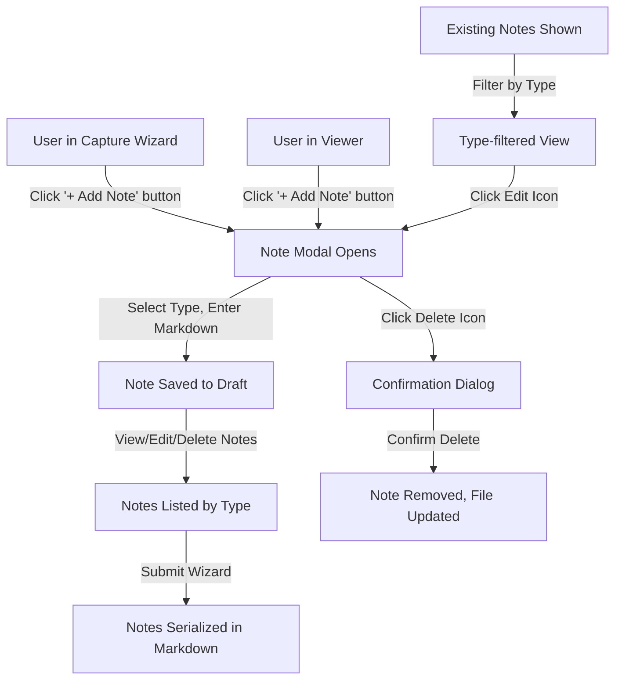

# Structured Notes System

**Feature Name:** Structured Notes System

**Filepath Name:** `structured-notes-v1`

**Date:** 2026-01-01

**Author:** PRD Writer Agent

**Related Epic(s)/PRD ID(s):** MVP-NOTES-001

**Related Documents:**
- [MeatyCapture PRD](../../initialization/prd.md)
- [Design Spec](../../initialization/design-spec.md)
- [Request Log Viewer PRD](./request-log-viewer-v1.md)
- [ItemDraft Model](../../../src/core/models/index.ts)

---

## 1. Executive Summary

Replace the static Notes field in the capture wizard and viewer screens with a structured notes system that organizes notes by type (General, Bug Fix Attempt, Validation, Other) and renders markdown content. Users can create, edit, delete, and filter notes directly from the capture and viewer interfaces, enabling richer documentation and better organization of item-level context.

**Priority:** MEDIUM

**Key Outcomes:**
- Outcome 1: Users can organize notes by type, improving clarity and discoverability
- Outcome 2: Markdown rendering enables rich formatting (bold, italic, lists, links, code) within notes
- Outcome 3: Notes editing workflow is self-contained within capture/viewer (no external editor needed)

---

## 2. Context & Background

### Current State

MeatyCapture currently provides a capture wizard with a simple Notes field:
- Single static text input field for freeform notes in ItemDraft
- Notes appear in the markdown request-log document as plain text under item details
- No structure or organization of note content
- No ability to edit notes after capture (except by manually editing markdown files)
- Notes are rendered as-is without markdown formatting

**Capture flow today:**
1. Project selection
2. Doc selection (new or existing)
3. Item Details: Type, Domain, Context, Priority, Status, Tags, Notes (single field)
4. Review and submit

**Viewer shows:**
- Notes as plain text below item metadata
- No structure or filtering options for notes

### Problem Space

Users creating detailed request logs often want to:
- Capture multiple pieces of information at different times (initial observation, validation results, fix attempts)
- Distinguish between problem descriptions, validation notes, and implementation attempts
- Format notes with markdown (lists, code blocks, links) for clarity
- Organize notes logically without creating separate items
- Edit notes after initial capture without touching markdown files
- Filter and search by note type in the viewer

**Current pain points:**
1. All notes mixed together in single field; no structure or organization
2. Cannot edit notes after submission without manual markdown editing
3. No markdown formatting support for note content
4. Difficult to distinguish between different types of notes (problem, validation, fix attempts)
5. Cannot filter by note type in viewer

### Current Alternatives / Workarounds

**Manual markdown editing:**
- Users open the markdown file directly and edit the notes field
- Time-consuming and error-prone
- Requires understanding of markdown frontmatter syntax

**Creating separate items:**
- Users create multiple request-log items instead of notes within one item
- Creates clutter and duplicate context
- Breaks the logical grouping of related information

### Architectural Context

**MeatyCapture layered architecture:**
- **UI Layer**: React components (wizard, viewer, shared components)
- **Core Layer**: Headless domain models (ItemDraft, RequestLogItem, RequestLogDoc)
- **Adapters Layer**: Port implementations (DocStore for file I/O, ProjectStore)
- **Storage Layer**: File system with markdown serialization

**Relevant existing patterns:**
- `ItemDraft` interface used during capture workflow
- `RequestLogItem` persisted with ID and created_at
- Markdown serialization via request-log format (YAML frontmatter + markdown sections)
- Backup strategy: `.bak` files created before write/append operations

---

## 3. Problem Statement

Users need to capture and organize multiple related notes within a single request-log item, with ability to edit, delete, and filter notes by type without touching markdown files or creating duplicate items.

**User Story Format:**
> "As a developer creating a request log item, when I want to capture the initial bug report AND the validation results AND the fix attempt, I should be able to add multiple structured notes organized by type instead of creating three separate items."

**Technical Root Cause:**
- `ItemDraft` interface has single `notes: string` field
- Markdown serializer treats notes as plain text block
- UI provides no affordance for adding/editing multiple notes
- RequestLogDoc model has no Note entity with type and timestamps

---

## 4. Goals & Success Metrics

### Primary Goals

**Goal 1: Enable structured note capture and organization**
- Users can add multiple notes to a single item during capture
- Each note has a type (General, Bug Fix Attempt, Validation, Other)
- Notes are grouped by type in capture review screen

**Goal 2: Support markdown formatting in notes**
- Markdown toolbar provides formatting options (bold, italic, lists, links, code)
- Notes render as markdown in viewer screen
- No raw markdown syntax visible in UI

**Goal 3: Enable note CRUD within capture and viewer workflows**
- Users can add notes via modal from both capture and viewer screens
- Users can edit existing notes without leaving the app
- Users can delete notes with confirmation dialog
- Changes persist to markdown file

**Goal 4: Improve note discoverability in viewer**
- Notes grouped by type with visual separation
- Filter dropdown allows filtering by note type
- Most recent notes shown first within each group

### Success Metrics

| Metric | Baseline | Target | Measurement Method |
|--------|----------|--------|-------------------|
| Notes per item (avg) | 1 | 2.5+ | Analytics on captured items |
| Editor task time | N/A | <30 sec to add note | Usability testing |
| Markdown adoption | 0% | 40%+ of notes contain formatting | File content analysis |
| Note filtering accuracy | N/A | 100% correct grouping by type | Automated tests |

---

## 5. User Personas & Journeys

### Personas

**Primary Persona: Triage Engineer**
- Role: Triages bug reports and assigns to developers
- Needs: Capture initial observations, validation results, and decision reasoning in one item
- Pain Points: Currently creates multiple items for related information; difficult to maintain context

**Secondary Persona: Implementation Engineer**
- Role: Implements fixes and logs enhancements
- Needs: Track fix attempts, blockers encountered, and solution decisions
- Pain Points: Cannot add notes after initial capture without manual markdown editing

### High-level Flow



---

## 6. Requirements

### 6.1 Functional Requirements

| ID | Requirement | Priority | Notes |
| :-: | ----------- | :------: | ----- |
| FR-1 | Note has id, type, content (markdown), created_at, updated_at | Must | Enables CRUD operations and persistence |
| FR-2 | Note types: General, Bug Fix Attempt, Validation, Other | Must | Allows type-based organization |
| FR-3 | Capture wizard shows "+ Add Note" button at bottom | Must | Enables notes in capture workflow |
| FR-4 | Clicking "+ Add Note" opens modal with type dropdown + markdown editor | Must | UX pattern for note creation |
| FR-5 | Markdown toolbar in editor (bold, italic, lists, links, code) | Should | Supports formatting without syntax knowledge |
| FR-6 | Notes grouped by type in capture review screen | Should | Improves clarity during review |
| FR-7 | Notes display in viewer below item metadata | Must | Allows viewing of persisted notes |
| FR-8 | Notes grouped by type in viewer, most recent first | Should | Improves readability and organization |
| FR-9 | Filter dropdown in notes section to filter by type | Should | Enables fast navigation to specific note types |
| FR-10 | Each note shows Edit/Delete icons in top-right corner | Should | Enables note CRUD after capture |
| FR-11 | Clicking Edit opens pre-filled modal with note details | Should | Allows editing without file manipulation |
| FR-12 | Clicking Delete shows confirmation dialog before removal | Should | Prevents accidental deletion |
| FR-13 | Notes serialize to markdown with metadata in document | Must | Persists notes to file; must parse on read |
| FR-14 | Notes list shows created and updated timestamps | Could | Provides audit trail for changes |

### 6.2 Non-Functional Requirements

**Performance:**
- Note operations (add, edit, delete) complete in <500ms
- Viewer render with 50 notes per item in <200ms
- Markdown parsing completes in <100ms for typical note (500 chars)

**Security:**
- File corruption prevention: backup before write/append (existing strategy)
- Validation: note content length limits (10,000 chars per note)
- XSS prevention: sanitize markdown output before rendering (use safe markdown library)

**Accessibility:**
- WCAG 2.1 AA compliance for note modal and controls
- Markdown editor accessible via keyboard (Tab, Enter, Shift+Enter)
- Screen reader announces note type, timestamps, edit/delete actions
- Focus management: modal focus trap; restore focus to trigger button on close

**Reliability:**
- Concurrent edit handling: last-write wins (consistent with MVP approach)
- Backup strategy: existing file-local adapter backup mechanism extends to notes
- Parse failures gracefully: warn user, offer backup restore option
- Handle corrupted note data: skip corrupted note, preserve document integrity

**Observability:**
- Structured logging for note operations (create, update, delete)
- Include: operation type, note_id, item_id, doc_id, timestamp, success/failure
- No PII in logs (exclude note content)

---

## 7. Scope

### In Scope

- **Data Model**: New Note entity in core models with id, type, content, created_at, updated_at
- **UI Components**: NoteModal, NoteCard, NotesList, NoteTypeFilter, MarkdownEditor with toolbar
- **Capture Wizard**: "+ Add Note" button, notes review display, type-grouped notes
- **Viewer Screen**: Notes section with type grouping, edit/delete icons, type filter dropdown
- **Serialization**: Markdown format for notes in request-log document frontmatter and body
- **CRUD Operations**: Add, read, edit, delete notes; persist to markdown file
- **Core Logic**: Note validation, ID generation, type filtering, markdown parsing

### Out of Scope

- **Collaborative editing**: No real-time sync or conflict resolution beyond MVP last-write-wins
- **Note templates**: No pre-defined templates for specific note types
- **Note search/full-text**: No searching across note content (separate feature)
- **Note versioning**: No history tracking or diff views of note changes
- **Server-side storage**: Notes persist to local markdown files only in MVP
- **Rich text editor**: Markdown with toolbar only; no WYSIWYG editor
- **Custom note types**: Only 4 fixed types in MVP; no user-defined types

---

## 8. Dependencies & Assumptions

### External Dependencies

- **Markdown Library**: Use existing markdown parser (check: remark/unified stack)
- **React**: Core UI framework (already in project)
- **TypeScript**: Type safety for Note model and operations

### Internal Dependencies

- **Core Models**: ItemDraft → Note array; RequestLogItem → Note array (required changes)
- **Serializer**: Markdown serializer must handle note format (new format spec needed)
- **DocStore Port**: File I/O adapter must support note persistence (extends existing append/write)
- **ItemDraft Interface**: Must add notes array; backward compatibility for existing data

### Assumptions

- **Single-user model**: No concurrent multi-user editing; last-write wins (MVP)
- **File-local storage only**: Notes persist to markdown files only; no server-side variant in MVP
- **Markdown is sufficient**: Users can create formatted notes with toolbar support
- **Note type taxonomy fixed**: 4 note types sufficient for MVP; no user-defined types
- **Existing markdown documents**: Old items without notes field simply have empty notes array
- **Backup strategy sufficient**: Existing `.bak` file backup prevents data loss
- **No note metadata queries**: Cannot search/filter notes on server (all in-memory for MVP)

### Feature Flags

- `ENABLE_STRUCTURED_NOTES`: Toggle entire feature on/off during rollout
- `NOTES_MARKDOWN_EDITOR`: Toggle markdown toolbar (fallback to plain textarea)

---

## 9. Risks & Mitigations

| Risk | Impact | Likelihood | Mitigation |
| ----- | :----: | :--------: | ---------- |
| Markdown serialization breaks existing documents | High | Medium | Backward-compatible format; test with sample documents; rollback plan |
| XSS via unsanitized markdown rendering | High | Low | Use safe markdown library (remark/rehype); sanitize HTML output |
| File corruption during note write | High | Low | Extend existing backup strategy; test backup/restore flow |
| Modal focus trap breaks accessibility | Medium | Medium | Use focus-trap library; test with screen readers; WCAG audits |
| Backward compatibility: old items without notes | Medium | Medium | Default to empty array; handle missing notes gracefully |
| Performance with many notes (50+) | Medium | Low | Lazy-load notes; virtualize long lists; benchmark before launch |
| Concurrent edits lose data | Medium | Medium | Warn user on stale data; implement last-write-wins consistently |

---

## 10. Target State (Post-Implementation)

### User Experience

**Capture Workflow:**
1. User progresses through wizard to Item Details step
2. Instead of single static Notes field, sees "+ Add Note" button at bottom
3. Clicking button opens modal with Type dropdown (General, Bug Fix Attempt, Validation, Other) and markdown editor with toolbar
4. User enters note content and saves
5. Note appears in review screen grouped by type
6. User can add more notes or submit wizard
7. All notes serialize to markdown file with type and timestamps

**Viewer Workflow:**
1. User views existing item in request-log viewer
2. Below item metadata, sees Notes section with type filter dropdown
3. Notes grouped by type (default: all types shown), most recent first
4. Each note card shows type badge, content (rendered markdown), timestamps, edit/delete icons
5. Clicking "+ Add Note" opens same modal as capture
6. Clicking Edit pre-fills modal with existing note content
7. Clicking Delete shows confirmation before removal
8. Changes immediately persist to markdown file

### Technical Architecture

**Core Layer - Data Model:**
```typescript
interface Note {
  id: string;                    // NOTE-YYYYMMDD-<project>-<item>-XX
  type: 'General' | 'Bug Fix Attempt' | 'Validation' | 'Other';
  content: string;               // Markdown content
  created_at: Date;
  updated_at: Date;
}

interface ItemDraft {
  // ... existing fields ...
  notes: Note[];                 // Replaces string; array of structured notes
}

interface RequestLogItem {
  // ... existing fields ...
  notes: Note[];                 // Replaces string; persisted notes
}
```

**Serialization Format:**
```yaml
---
type: request-log
doc_id: REQ-20260101-meatycapture
item_count: 1
tags: [ux, notes]
items_index:
  - id: REQ-20260101-meatycapture-01
    type: enhancement
    title: Structured Notes System
notes:
  - id: NOTE-20260101-meatycapture-01-01
    type: General
    created_at: 2026-01-01T10:00:00Z
  - id: NOTE-20260101-meatycapture-01-02
    type: Bug Fix Attempt
    created_at: 2026-01-01T10:30:00Z
---

### REQ-20260101-meatycapture-01 - Structured Notes System

**Type:** enhancement | **Domain:** web | **Priority:** medium | **Status:** triage
**Tags:** ux, notes

- Problem/goal: Enable structured notes with types and markdown formatting

#### Notes

**Note 1: General**
- Created: 2026-01-01 10:00 | Updated: 2026-01-01 10:00

This is an initial observation with **bold** text and [links](https://example.com).

**Note 2: Bug Fix Attempt**
- Created: 2026-01-01 10:30 | Updated: 2026-01-01 10:30

Attempted fix using `code block`:
\`\`\`typescript
// implementation here
\`\`\`
```

**UI Components:**
- `NoteModal`: Modal with type dropdown + markdown editor + save/cancel
- `MarkdownEditor`: Textarea with toolbar (bold, italic, lists, links, code)
- `NoteCard`: Displays note with type badge, content, timestamps, edit/delete icons
- `NotesList`: Container managing type grouping, filtering, add button
- `NoteTypeFilter`: Dropdown for filtering notes by type

**Adapter Changes:**
- Extend serializer to parse/write notes from markdown
- ID generation: NOTE-{doc_id}-{item_counter}-{note_counter}
- Backward compatibility: handle missing notes gracefully

### Observable Outcomes

- Users capture multi-step problem/solution context in single item
- Markdown formatting visible in viewer (not raw syntax)
- Edit/delete capabilities enable note management without file editing
- Filter by type improves note discoverability in viewer
- Item count stays consistent; notes don't artificially inflate item count

---

## 11. Overall Acceptance Criteria (Definition of Done)

### Functional Acceptance

- [x] Note data model added to core (id, type, content, created_at, updated_at)
- [x] NoteModal component with type dropdown and markdown editor
- [x] "+ Add Note" button shown in capture wizard (bottom of Item Details step)
- [x] "+ Add Note" button shown in viewer (below notes section)
- [x] Notes displayed in capture review screen grouped by type
- [x] Notes displayed in viewer grouped by type, most recent first
- [x] Edit/Delete icons functional on note cards
- [x] Confirmation dialog shown before note deletion
- [x] Note type filter dropdown filters viewer notes correctly
- [x] Markdown toolbar supports: bold, italic, lists, links, code
- [x] All note CRUD operations (create, read, edit, delete) working end-to-end
- [x] Notes persist to markdown file with correct format
- [x] Backward compatibility: old items without notes load correctly

### Technical Acceptance

- [x] Follows MeatyCapture layered architecture (UI → Core → Adapters → FS)
- [x] Note model in core/models with TypeScript interfaces
- [x] Serializer handles note parsing and writing
- [x] ID generation for notes follows project pattern (NOTE-{date}-{project}-{item}-{note})
- [x] Backup strategy extended to note operations
- [x] Concurrent edit handling consistent (last-write wins)
- [x] No file corruption on note operations (backup before write)
- [x] Type safety: all Note operations typed in TypeScript

### Quality Acceptance

- [x] Unit tests: Note model, ID generation, type validation (>80% coverage)
- [x] Integration tests: Capture wizard + notes, viewer + notes, CRUD operations
- [x] File I/O tests: Parse/write markdown with notes, backup/restore, corruption recovery
- [x] Snapshot tests: Markdown output format for various note content
- [x] Accessibility: Modal focus trap, keyboard navigation, screen reader compatibility
- [x] End-to-end: Full note lifecycle (add → review → persist → view → edit → delete)

### Documentation Acceptance

- [x] Note data model documented (core/models/index.ts)
- [x] Markdown serialization format documented
- [x] Component API documented (NoteModal, NoteCard, NotesList, etc.)
- [x] Backward compatibility guide for existing documents
- [x] User guide for adding/editing notes in capture and viewer

---

## 12. Assumptions & Open Questions

### Assumptions

- Note type enum fixed to 4 values (General, Bug Fix Attempt, Validation, Other) in MVP
- Single-user local file model sufficient; no server-side note sync needed
- Markdown with toolbar sufficient; no WYSIWYG editor required
- Backup strategy prevents data loss; no need for version control
- Most users will benefit from type-based organization
- Note ID pattern can follow existing doc_id/item_id conventions

### Open Questions

- [ ] **Q1**: Should notes have visibility/sharing permissions? Or local-only in MVP?
  - **A**: Local-only in MVP; no permissions layer yet

- [ ] **Q2**: Should deleting a note remove it from markdown or mark as deleted?
  - **A**: Remove from markdown entirely (simplest for MVP)

- [ ] **Q3**: What markdown library should be used for parsing and rendering?
  - **A**: TBD - check existing stack; recommend unified/remark ecosystem if not present

- [ ] **Q4**: Should note content be searchable across the app?
  - **A**: Out of scope for MVP; full-text search is separate feature

- [ ] **Q5**: Should notes be exported or shared alongside items?
  - **A**: Notes export with item to markdown; share same constraints as item

- [ ] **Q6**: Maximum characters per note?
  - **A**: Recommend 10,000 chars; enforced in validation

---

## 13. Appendices & References

### Related Documentation

- **MeatyCapture Architecture**: [CLAUDE.md](../../../../CLAUDE.md)
- **Core Models**: [src/core/models/index.ts](../../../../src/core/models/index.ts)
- **Request Log Format**: [docs/project_plans/initialization/design-spec.md](../../initialization/design-spec.md)
- **Serializer Implementation**: [src/core/serializer/](../../../../src/core/serializer/)
- **Viewer Component**: [src/ui/viewer/](../../../../src/ui/viewer/)

### Design System References

- **Glass Morphism**: [docs/design/glass-morphism.md](../../design/glass-morphism.md)
- **Mobile Viewer Spec**: [docs/design/mobile-viewer-ui-spec.md](../../design/mobile-viewer-ui-spec.md)
- **Shared Components**: [src/ui/shared/](../../../../src/ui/shared/)

### Similar Features

- [Request Log Viewer PRD](./request-log-viewer-v1.md) - Viewer screen with filtering
- [Mobile Viewer UX PRD](../harden-polish/mobile-viewer-ux-v1.md) - Mobile optimization patterns

---

## Implementation

### Phased Approach

**Phase 1: Core Data Model & Serialization (3 days)**
- Duration: 3 days
- Tasks:
  - [ ] Add Note interface to core/models/index.ts
  - [ ] Update ItemDraft and RequestLogItem to include notes array
  - [ ] Add note type enum and validation
  - [ ] Implement note ID generation following project pattern
  - [ ] Update markdown serializer to parse/write notes
  - [ ] Add backward compatibility for existing items without notes
  - [ ] Write unit tests for Note model and serialization

**Phase 2: UI Components (4 days)**
- Duration: 4 days
- Tasks:
  - [ ] Create NoteModal component with type dropdown and markdown editor
  - [ ] Implement MarkdownEditor with toolbar (bold, italic, lists, links, code)
  - [ ] Create NoteCard component with type badge, content, timestamps
  - [ ] Create NotesList container with type grouping and filtering
  - [ ] Create NoteTypeFilter dropdown component
  - [ ] Implement focus management and accessibility (WCAG 2.1 AA)
  - [ ] Write component tests and snapshot tests

**Phase 3: Capture Wizard Integration (3 days)**
- Duration: 3 days
- Tasks:
  - [ ] Add "+ Add Note" button to Item Details step
  - [ ] Wire NoteModal to capture wizard state
  - [ ] Display notes grouped by type in review screen
  - [ ] Implement add/edit/delete in capture review
  - [ ] Handle note persistence on wizard submit
  - [ ] Write integration tests for capture + notes workflow
  - [ ] Test backup/restore flow with notes

**Phase 4: Viewer Integration (3 days)**
- Duration: 3 days
- Tasks:
  - [ ] Add Notes section to item detail view in viewer
  - [ ] Wire NoteTypeFilter to viewer state
  - [ ] Implement add/edit/delete in viewer
  - [ ] Persist note changes to markdown file immediately
  - [ ] Test concurrent edit handling (last-write wins)
  - [ ] Write integration tests for viewer + notes workflow
  - [ ] Mobile responsive testing

**Phase 5: Testing & Polish (2 days)**
- Duration: 2 days
- Tasks:
  - [ ] End-to-end testing of full note lifecycle
  - [ ] Accessibility audit (screen readers, keyboard navigation)
  - [ ] Performance testing with large note counts
  - [ ] Error handling and edge cases
  - [ ] Documentation and user guide
  - [ ] Final QA and bug fixes

---

## Epics & User Stories Backlog

| Story ID | Short Name | Description | Acceptance Criteria | Estimate |
|----------|-----------|-------------|-------------------|----------|
| NOTES-001 | Note Model | Add Note interface and validation to core | Note entity with all fields; types enum; validation passing | 5 pts |
| NOTES-002 | Serialization | Update markdown serializer for notes | Notes parse/write correctly; backward compatibility works | 8 pts |
| NOTES-003 | NoteModal | Build note creation/editing modal | Modal opens/closes; form validates; saves to draft | 5 pts |
| NOTES-004 | MarkdownEditor | Implement editor with toolbar | Toolbar buttons work; keyboard shortcuts supported | 5 pts |
| NOTES-005 | NoteCard | Create note card display component | Shows type, content, timestamps, icons; responsive | 3 pts |
| NOTES-006 | NotesList | Build container with grouping/filtering | Groups by type; filters work; most recent first | 5 pts |
| NOTES-007 | Capture Integration | Wire notes into capture wizard | Add button works; notes display in review; persist on submit | 8 pts |
| NOTES-008 | Viewer Integration | Wire notes into viewer screen | Add button works; edit/delete work; file persistence works | 8 pts |
| NOTES-009 | Accessibility | Ensure WCAG 2.1 AA compliance | Modal focus trap; keyboard nav; screen reader compat | 5 pts |
| NOTES-010 | Testing | Comprehensive test coverage | Unit >80%, integration, snapshot, e2e | 13 pts |
| NOTES-011 | Documentation | User guide and API docs | Setup guide, usage examples, API reference | 5 pts |

---

**Progress Tracking:**

See progress tracking: `.claude/progress/structured-notes/all-phases-progress.md`

---

## Summary

The Structured Notes System feature transforms MeatyCapture's note capture from a single static field into a rich, organized system. By introducing note types, markdown formatting, and full CRUD capabilities within the UI, users can better document complex problems, solutions, and validations without leaving the app or creating unnecessary duplicate items.

This PRD provides the detailed specification needed for agents to implement the feature across all layers: data model, core logic, serialization, UI components, and integration into existing capture and viewer workflows.
