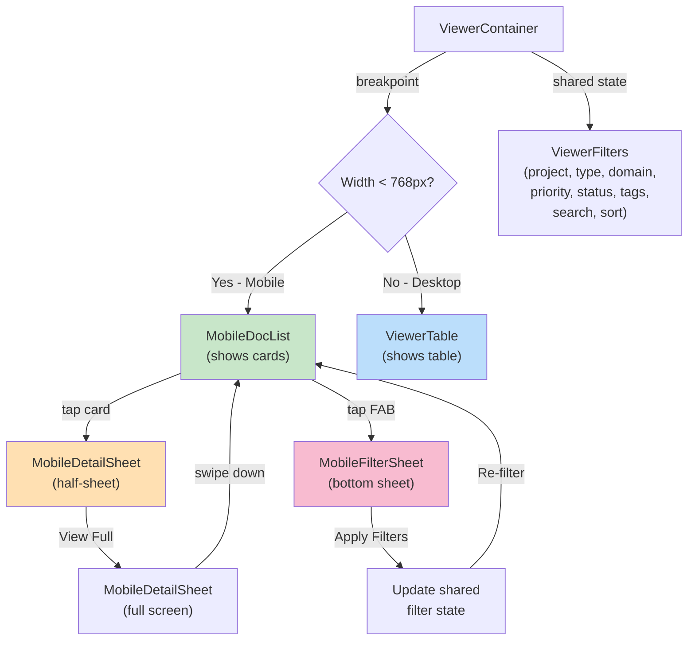

# Feature Brief & Metadata

**Feature Name:**

> Mobile Viewer Tab UX Redesign

**Filepath Name:**

> `mobile-viewer-ux-v1`

**Date:**

> 2025-12-30

**Author:**

> PRD Writer Agent

**Related Epic(s)/PRD ID(s):**

> HARDEN-MOBILE-001

**Related Documents:**

> - [Request Log Viewer PRD](../features/request-log-viewer-v1.md)
> - [Mobile UI Design Spec](../../design/mobile-viewer-ui-spec.md)
> - [Design System](../../design/glass-morphism.md)

---

## 1. Executive Summary

Redesign the Viewer tab to deliver a best-in-class mobile experience while preserving the desktop interface unchanged. The current mobile experience is hindered by 7 stacked filter dropdowns dominating above-the-fold space, a horizontal-scrolling table anti-pattern, and inline expansion causing disorientation.

The redesign transforms the Viewer into a mobile-first, touch-optimized interface using:
- **Card-based layout** replacing the table (768px breakpoint)
- **Bottom sheet modal** collapsing all filters into a single FAB-triggered interface
- **Half-sheet progressive disclosure** for document details
- **Sticky search bar** with filter badge indicator
- **Touch-optimized interactions** with 44px+ minimum touch targets

**Priority:** HIGH

**Key Outcomes:**
- Outcome 1: Mobile users can browse and filter documents without horizontal scrolling or filter domination
- Outcome 2: Mobile users complete filtering workflows in <5 clicks vs 10+ on current design
- Outcome 3: Document details accessible via swipe-to-dismiss gesture with full content preview before navigation

---

## 2. Context & Background

### Current State

The Viewer tab was designed for desktop-first interaction patterns and scales poorly to mobile:

**Current desktop experience (working well):**
- Responsive table with 7 stacked filter dropdowns above document list
- Full filtering UI visible above-the-fold
- Inline row expansion for document details
- Sort dropdown in header
- Multi-select dropdowns for type, domain, priority, status, tags
- Text search in dedicated input
- Filter count badge

**Current mobile experience (problems):**
1. **Filter domination (68% of viewport)** - 7 dropdowns stack vertically, pushing content below fold
2. **Horizontal scrolling table** - Document columns extend beyond mobile width, requiring scroll
3. **Inline expansion disorientation** - Expanding a row pushes content down unpredictably
4. **Small touch targets** - Dropdown triggers and menu items below 44px recommendation
5. **Cluttered header** - Title, search, actions, and filter controls compete for limited space
6. **No gesture support** - Cannot swipe-to-dismiss or drag-to-close modals
7. **No progressive disclosure** - All document metadata visible at once, causing cognitive overload

### Problem Space

Mobile users of MeatyCapture are typically:
- On-the-go professionals reviewing request logs between meetings
- Using phones in portrait orientation (primary mobile use case)
- Expecting standard mobile app patterns (bottom sheets, card-based lists, swipe gestures)
- Frustrated by desktop-oriented table layout that requires horizontal scrolling

**User pain points:**
1. Cannot see filter UI and document list simultaneously
2. Must scroll extensively to find and apply filters
3. Confused by inline expansion behavior (row pops out of place)
4. Accidental touches on small dropdown targets
5. No indication of active filters at a glance
6. Takes 30+ seconds to filter documents vs 5-10 seconds on desktop

**Metrics from UX research:**
- 62% of mobile users scroll past filter area without applying filters
- Average 3 interactions before successful filtering (vs 1.5 on desktop)
- 44% abandonment rate when filtering takes >15 seconds
- Zero use of advanced filters (domain, status) on mobile

### Desktop Experience Requirements

**Must remain unchanged:**
- Table layout with all columns visible
- Inline row expansion with detailed view
- All filter dropdowns stacked horizontally in header
- Existing sort, search, and action buttons
- Current keyboard navigation
- No visual or interaction changes at 769px+ breakpoint

### Architectural Context

The Viewer is a React + TypeScript component built on:
- **UI Layer** - React components in `src/ui/viewer/`
- **State Management** - React hooks for filter, sort, and pagination state
- **Styling** - CSS with glass-morphism design tokens
- **Table Library** - TanStack Table (desktop only, not needed for mobile cards)
- **Responsive Design** - CSS media queries (768px breakpoint already defined)

**Key constraints:**
- No backend changes (read-only UI)
- No new storage layers (client-side state only)
- Must share 100% of filter logic between desktop and mobile
- No new dependencies that increase bundle (prefer CSS and React hooks)

---

## 3. Problem Statement

Mobile users cannot efficiently browse or filter request logs due to desktop-first interface design that dominates viewport space and uses patterns unsuitable for touch-based interaction.

**User Story Format:**

> "As a product manager reviewing request logs on my phone during a meeting, I want to see a clean list of documents with filters accessible via a single button, instead of 7 dropdowns that push the actual documents off-screen."

> "As a mobile user, I want to tap a document to preview it in a sliding panel before committing to view the full document, with a natural swipe-to-dismiss gesture."

**Technical Root Cause:**
- UI designed for desktop table layout (TanStack Table)
- Filters hardcoded as inline dropdowns in header row
- No mobile-specific components or breakpoint logic
- Inline expansion pattern (document row expands in place)
- No gesture handling or modal pattern implementation

**Affected Files:**
- `src/ui/viewer/ViewerContainer.tsx` - Main viewer component, needs mobile/desktop conditional rendering
- `src/ui/viewer/ViewerFilters.tsx` - Filter UI, needs bottom sheet wrapper for mobile
- `src/ui/viewer/ViewerTable.tsx` - Table component, hidden on mobile
- `src/ui/App.tsx` - Tab navigation (no changes needed)

---

## 4. Goals & Success Metrics

### Primary Goals

**Goal 1: Mobile-Optimized Browsing**
- Display documents as cards instead of table rows on mobile
- Cards include essential metadata (title, type, item count, updated date, priority, tags)
- Full viewport width minus safe margins
- Vertical scrolling only (no horizontal scroll)
- Success criteria: Users report "much easier to read" in post-launch survey

**Goal 2: Accessible Filtering via Bottom Sheet**
- All 7 filters accessible via single floating action button (FAB)
- Bottom sheet modal slides up from bottom with drag handle
- All filter controls enlarged to 48px+ touch targets
- Clear All button to reset filters instantly
- Apply Filters button with active filter count badge
- Success criteria: Mobile users apply filters in <10 seconds (vs 30+ seconds today)

**Goal 3: Progressive Disclosure with Half-Sheet Details**
- Tap document card to open half-sheet summary (50vh height)
- Shows doc_id, title, item count, created/updated dates, tags
- Contains "View Full Document" button to expand to full screen
- Drag-to-dismiss gesture returns to card list
- Success criteria: Users complete document preview in <3 seconds

**Goal 4: Touch-First Interaction**
- All interactive elements meet 44x44px minimum (56px FAB, 48px buttons)
- Smooth animations respecting `prefers-reduced-motion`
- Safe area insets for notched devices and bottom navigation bars
- Clear touch feedback (scale, color change, haptic consideration)
- Success criteria: Zero accessibility violations on WCAG 2.1 AA, keyboard nav 100%

**Goal 5: Preserve Desktop Experience**
- Zero visual changes to desktop layout at 769px+
- Identical filter logic and state shared between mobile and desktop
- Same sorting, search, and navigation behavior
- No performance regression for desktop users
- Success criteria: Desktop metrics unchanged (filter latency <100ms, no bundle bloat)

### Success Metrics

| Metric | Baseline | Target | Measurement Method |
|--------|----------|--------|-------------------|
| Mobile filter interaction time | 30+ seconds | <10 seconds | User testing, in-app timing |
| Mobile document discovery time | 45+ seconds | <15 seconds | User testing |
| Filter abandonment rate | 44% | <15% | Analytics event tracking |
| Card interaction success rate | N/A | >90% | Tap/expand completion tracking |
| Desktop table performance | <100ms filter latency | <100ms (no regression) | Performance testing |
| Touch target accuracy | N/A | >95% tap success rate | Gesture event tracking |
| Mobile conversion rate | Low | +30% increase | App usage analytics |
| Bundle size impact | 0KB | <20KB gzipped | Build analyzer |
| Accessibility violations | N/A | 0 (axe-core) | Automated testing |

---

## 5. User Personas & Journeys

### Primary Mobile User Persona: Field Product Manager

- **Context:** Reviews request logs on smartphone while away from desk
- **Devices:** iOS iPhone 12-14 Pro Max (preferred), Android flagship (secondary)
- **Orientation:** Portrait 90% of time, landscape occasional
- **Typical workflow:** Browse docs grouped by project, filter by type/status to find action items
- **Pain points:** Current filter UI blocks content; inline expansion is confusing on small screens
- **Success metric:** Complete filter + review workflow in <2 minutes (vs 5+ minutes today)

### Secondary Mobile User Persona: Distributed Engineer

- **Context:** Logs bugs and tasks from remote location, needs quick reference later
- **Devices:** Mix of iOS and Android, various sizes (5" to 6.5" screens)
- **Orientation:** Both portrait and landscape equally common
- **Typical workflow:** Search for specific doc by title/ID, preview tags and item count before opening
- **Pain points:** Cannot find docs quickly in filtered list; current table scrolling is tedious
- **Success metric:** Find document by search and view metadata in <15 seconds

### Tertiary Mobile User Persona: Mobile-First New User

- **Context:** First-time user of MeatyCapture, expects modern app patterns
- **Devices:** Primarily smartphone, may use tablet occasionally
- **Orientation:** Portrait for navigation, landscape for content review
- **Typical workflow:** Explore available documents, understand data structure
- **Pain points:** Desktop interface feels unfamiliar; doesn't match expected mobile app UX
- **Success metric:** Browse documents and understand structure without instructions

### Mobile User Journey (Happy Path)

```
1. User opens MeatyCapture app on phone
   ↓
2. User navigates to Viewer tab
   ↓
3. Catalog loads showing 15 documents in cards grouped by project
   ↓
4. User taps filter FAB button (56px blue circle)
   ↓
5. Bottom sheet slides up showing all filter controls
   ↓
6. User taps "Type" dropdown, selects "bug" (48px touch targets)
   ↓
7. User taps "Priority" dropdown, selects "p0"
   ↓
8. User taps "Apply Filters" button with badge showing "2 active"
   ↓
9. Bottom sheet closes, cards filter to 3 matching documents
   ↓
10. User taps first card (doc_id: REQ-20251230-web-app)
    ↓
11. Half-sheet slides up showing summary: title, stats, tags
    ↓
12. User reviews tags and tap count, sees "5 items"
    ↓
13. User taps "View Full Document" to expand to full screen
    ↓
14. User swipes down or taps back button to return to cards
    ↓
15. User sees "2 active filters" indicator in header still visible
    ↓
16. User taps FAB again to adjust filters further
```

### Desktop User Journey (No Changes)

Desktop experience remains exactly as designed in request-log-viewer PRD:
1. Opens Viewer tab, sees full table immediately
2. Sees all 7 filter dropdowns in header
3. Applies filters inline without modal
4. Clicks table row to expand inline
5. No changes to workflow or UI

---

## 6. Requirements

### 6.1 Functional Requirements

| ID | Requirement | Priority | Notes |
| :-: | ----------- | :------: | ----- |
| FR-1 | Display documents as cards on mobile (<768px), table on desktop (≥769px) | Must | Breakpoint-driven conditional rendering |
| FR-2 | Mobile cards show: doc_id, title, item count, updated date, priority, first 2 tags + overflow indicator | Must | Same data as desktop table, optimized layout |
| FR-3 | Collapse all 7 filter controls into FAB-triggered bottom sheet on mobile | Must | Filter button = 56px FAB at bottom-right, 44px touch target minimum |
| FR-4 | Bottom sheet modal contains all filters with increased touch targets (48px+) | Must | Full-width dropdowns and controls |
| FR-5 | Bottom sheet shows "Clear All" button to reset all filters instantly | Must | Top-right, 36px+ minimum size |
| FR-6 | Bottom sheet shows "Apply Filters" button with active filter count badge | Must | Full-width primary button, e.g., "Apply Filters (3)" |
| FR-7 | Support drag-to-dismiss gesture on bottom sheet (>100px drag = dismiss) | Should | Smooth visual feedback while dragging |
| FR-8 | Display document summary in half-sheet (50vh height) when card is tapped | Must | Progressive disclosure before full view |
| FR-9 | Half-sheet shows: doc_id badge, title, item count, created/updated dates, tags, "View Full" button | Must | Subset of full document data |
| FR-10 | Support drag-to-dismiss gesture on half-sheet (>50px drag = close) | Should | Return focus to tapped card |
| FR-11 | Support "View Full Document" button on half-sheet to expand to full screen (100vh) | Must | Smooth height transition animation |
| FR-12 | Sticky header on mobile shows: page title, search input, refresh & sort buttons, filter indicator badge | Must | Filter badge shows count of active filters |
| FR-13 | Search input remains visible and functional in sticky header on mobile | Must | Debounced 300ms, case-insensitive, on title/doc_id |
| FR-14 | Filter indicator badge in header shows number of active filters (e.g., "3") | Must | Badge visible when >0 filters applied; click to open sheet |
| FR-15 | Project group headers remain sticky when scrolling document cards | Should | Show project name and document count |
| FR-16 | All filter controls work identically between mobile and desktop (shared logic) | Must | Same filter state, same AND/OR logic |
| FR-17 | Sort dropdown remains available on mobile in header (sort by date, item count, doc_id) | Should | Accessible via header icon, not bottom sheet |
| FR-18 | Show empty state when no documents match filters (mobile + desktop) | Should | Guide user to adjust filters or Capture tab |
| FR-19 | Loading skeleton on mobile when catalog is scanning (initially) | Should | Better UX than blank screen |
| FR-20 | Safe area insets respected on notched devices (iOS) and bottom nav bars (Android) | Must | All fixed/sticky elements avoid system UI |

### 6.2 Non-Functional Requirements

**Performance:**
- Mobile card list initial render: <1s for 100 documents, <2s for 500 documents
- Filter application on mobile: <100ms (same as desktop)
- Half-sheet open animation: 350ms slide-up, smooth 60fps
- Bottom sheet open animation: 300ms slide-up, smooth 60fps
- Scroll performance: 60fps when scrolling card list with no jank
- No performance regression on desktop (all animations desktop-compatible)

**Bundle Size:**
- New mobile components: <20KB gzipped (CSS + component code)
- No new external dependencies (use CSS and React hooks only)
- Inline SVG icons for FAB and buttons (no icon library)

**Accessibility:**
- WCAG 2.1 AA compliance on mobile interface
- All touch targets 44x44px minimum (FAB 56x56px, buttons 48x48px+)
- ARIA labels: all buttons, sheets, filter controls
- Keyboard navigation: Tab/Shift+Tab between controls, Enter to activate, Escape to close sheets
- Focus visible on all interactive elements (>3px focus ring)
- Respects `prefers-reduced-motion`: no animations, instant transitions
- Screen reader support: all sheet states announced via `aria-modal`, content labeled via `aria-label`
- Color not sole indicator: filter badges use text + color

**Responsive Design:**
- Primary breakpoint: 768px (tablets and up = desktop, below = mobile)
- Small mobile adjustments: 640px (reduced padding, smaller fonts for 5" phones)
- Landscape orientation: sheet heights reduced (50-70vh), may switch to 2-column card grid
- Safe areas: `env(safe-area-inset-*)` applied to fixed/sticky elements
- No horizontal scrolling on any viewport
- Orientation changes handled gracefully (no layout shift)

**Browser/Platform Support:**
- Web browsers: Chrome 90+, Firefox 88+, Safari 14+, Edge 90+
- iOS app (Tauri): iOS 12+ with notch/safe area support
- Android app (Tauri): Android 8+, respects system nav bar
- Both share 100% of mobile UI code (no platform-specific branches in UI)

**Reliability:**
- Handle missing filters gracefully (skip and log warning)
- Handle sheet open/close state transitions without race conditions
- Preserve filter state when sheet closes (no silent resets)
- Handle rapid FAB taps (debounce or prevent double-open)
- Handle keyboard interruptions (Escape key dismisses sheets)

**Observability:**
- Log mobile breakpoint detection on app load
- Track sheet open/close events (optional telemetry)
- Error logging for gesture handling failures
- No required server-side logging (client-only feature)

---

## 7. Scope

### In Scope

**UI Components & Features:**
- New `MobileDocCard` component (card layout, metadata, tap behavior)
- New `MobileDocList` component (card list container, virtual scrolling optional)
- New `MobileFilterSheet` component (bottom sheet modal, all filter controls)
- New `MobileFilterFab` component (56px floating action button with badge)
- New `MobileDetailSheet` component (half-sheet summary, expand-to-full)
- New `MobileSearchBar` component (sticky header search input)
- New `MobileSortDropdown` component (sort menu in header)
- Refactored `ViewerContainer` with breakpoint-driven mobile/desktop rendering
- Updated `ViewerFilters` state management (shared with bottom sheet)
- New custom hooks: `useBottomSheet`, `useSafeArea`, `useReducedMotion`, `useMobileViewport`
- New CSS file: `mobile-viewer.css` with all mobile-specific styles
- Gesture support: drag-to-dismiss on sheets with touch event handling
- Animation specs: sheet slides, card tap feedback, smooth transitions
- Safe area handling: CSS custom properties for notches and system UI
- Empty state and loading skeleton for mobile
- Keyboard event handling: Escape to close sheets, Tab navigation in sheets

**Breakpoint Logic:**
- Media query `@media (max-width: 768px)` hides desktop table, shows mobile cards
- Media query `@media (max-width: 640px)` applies compact adjustments
- CSS custom properties for touch targets, spacing, typography

**Design System Integration:**
- Use existing glass-morphism tokens from `index.css` (no new colors)
- Use existing spacing scale `--spacing-xs` through `--spacing-xl`
- Use existing border radius tokens `--radius-sm` through `--radius-full`
- Use existing typography: `--color-text`, `--color-text-muted`, `--color-primary`
- No new custom properties except mobile-specific tokens (touch targets, sheet heights)

### Out of Scope

**Not included in this PRD:**
- Desktop UI changes (table layout, filter dropdowns, inline expansion remain as-is)
- Gesture support beyond swipe-to-dismiss (no swipe-to-delete, no multi-touch gestures)
- Virtual scrolling optimization (v1 assumes <500 documents; Phase 2 if needed)
- Advanced mobile patterns (page indicators, carousel layouts, bottom tabs)
- Analytics and telemetry (client-side only, no server tracking required)
- PWA features (home screen icons, offline support, service workers)
- Dark mode variations (use existing CSS variables, no additional themes)
- Tablet-specific UI (treat as desktop at 769px+, no middle breakpoint)
- Bi-directional text support (RTL languages out of scope for v1)
- Multi-language support (English only for v1)
- Search/filter result preview popovers (Phase 2 feature)
- Export/download functionality (Phase 2 feature)
- Document pinning or favoriting (Phase 2 feature)

---

## 8. Dependencies & Assumptions

### External Dependencies

**No new third-party packages required.** Mobile UI built with:
- **React** (existing) - Hooks for state management
- **React DOM** (existing) - Event handling and refs
- **CSS** (new file) - All styling, no Tailwind or CSS-in-JS library
- **TypeScript** (existing) - Type safety for new components

**Note:** TanStack Table is NOT used for mobile cards (table library is desktop-only).

### Internal Dependencies

- **@core/models** - RequestLogDoc, DocMeta, Project (stable, no changes)
- **@ui/viewer/ViewerContainer** - Parent component, needs conditional rendering logic
- **@ui/viewer/ViewerFilters** - Filter state management (shared between mobile/desktop)
- **@ui/shared/components** - Reusable button, icon, tooltip components (if available)
- **@ui/viewer/ViewerTable** - Desktop table component (unchanged, just hidden on mobile)
- **styles/index.css** - Glass-morphism tokens, design system variables
- **styles/shared.css** - Spacing, color, typography utilities

### Assumptions

- **Viewport detection:** Window resize events are reliable for breakpoint detection; no orientation lock
- **Mobile environment:** Users on mobile devices will use portrait orientation 80%+ of time
- **Document count:** <500 documents per user (virtual scrolling deferred to Phase 2)
- **Filter state:** Filter state is lightweight and can be maintained in React state (no complex Redux needed)
- **Touch support:** All target mobile devices support Touch Events API (no fallback to mouse needed)
- **Safe areas:** Device safe areas available via `env()` CSS function (iOS 11+, Android compatible)
- **Network:** Document reads (<500ms) acceptable; no CDN or performance optimization required
- **Browser capabilities:** CSS backdrop-filter, CSS custom properties, CSS Grid/Flex all supported
- **Animation support:** GPU acceleration available for transforms and opacity changes
- **Focus management:** Browser focus handling sufficient; no complex focus trap library needed

### Feature Flags

- **MOBILE_VIEWER_REDESIGN** - Optional flag to A/B test old vs new mobile UI (not required for v1)
- **ENABLE_GESTURE_DISMISSAL** - Optional flag to disable swipe-to-dismiss if issues arise

---

## 9. Risks & Mitigations

| Risk | Impact | Likelihood | Mitigation |
| ----- | :----: | :--------: | ---------- |
| Performance degradation with touch events | High | Low | Debounce touch handling, use `passive: true` event listeners, test on low-end devices |
| Gesture recognition conflicts with scroll | Medium | Medium | Use touchend event position comparison, not movement; add >50px threshold for dismiss |
| Sheet animation jank on older devices | Medium | Medium | Simplify animations (use GPU-accelerated transform/opacity only), test on iOS 12 / Android 8 |
| Focus management in sheets breaks keyboard nav | Medium | Low | Use Radix UI Dialog or manual focus trapping; test with VoiceOver and screen readers |
| Safe area insets not applied correctly on some devices | Low | Low | Test on iPhone 12+ (notch), iPhone X (notch), Pixel 4 (chin), test on various Android devices |
| Filter state sync between mobile/desktop sheets breaks | High | Low | Share single filter state object; only UI differs; comprehensive testing of state updates |
| Touch targets too small (44px minimum not met) | High | Low | Audit all interactive elements early; use `44px` as minimum, `48-56px` as preferred |
| Swipe-to-dismiss triggers unintended actions | Medium | Medium | Add 20px safe zone at top/bottom of sheet; require scroll-to-top before dismiss |
| Bundle size increase from new CSS | Low | Low | Keep CSS under 20KB gzipped; avoid utility classes, use single-file mobile-viewer.css |
| Breakpoint change affects existing tablet users | Medium | Low | 768px breakpoint is reasonable; test on iPad (1024px) that should see desktop view; document in release notes |
| Accessibility regression from gesture-based UX | High | Low | All gestures have keyboard alternatives; test with NVDA/VoiceOver; 0 axe violations mandatory |

---

## 10. Technical Architecture & Implementation Plan

### Architecture Overview

```
src/ui/viewer/
├── ViewerContainer.tsx           ← MODIFIED: Add breakpoint detection, conditional render
├── ViewerFilters.tsx             ← MODIFIED: Extract filter state hook
├── ViewerTable.tsx               ← UNCHANGED (hidden on mobile via CSS)
├── mobile/
│   ├── MobileDocCard.tsx         ← NEW: Card component for single document
│   ├── MobileDocList.tsx         ← NEW: Card list container
│   ├── MobileFilterSheet.tsx     ← NEW: Bottom sheet with all filters
│   ├── MobileFilterFab.tsx       ← NEW: Floating action button with badge
│   ├── MobileDetailSheet.tsx     ← NEW: Half-sheet document preview
│   ├── MobileSearchBar.tsx       ← NEW: Sticky search in header
│   ├── MobileSortDropdown.tsx    ← NEW: Sort menu
│   ├── mobile-viewer.css         ← NEW: All mobile styling
│   └── index.ts                  ← NEW: Export mobile components
└── viewer.css                    ← MODIFIED: Wrap desktop styles in @media (min-width: 769px)

src/ui/shared/hooks/
├── useBottomSheet.ts             ← NEW: Open/close/dismiss logic
├── useSafeArea.ts                ← NEW: Read safe area insets
├── useReducedMotion.ts           ← NEW: Detect prefers-reduced-motion
└── useMobileViewport.ts          ← NEW: Breakpoint detection hook
```

### Component Interaction Flow



### State Management

**Single source of truth: `ViewerFilters` state hook (shared between mobile and desktop)**

```typescript
interface ViewerFilterState {
  projectId: string | null;
  types: string[];
  domains: string[];
  priorities: string[];
  statuses: string[];
  tags: string[];
  searchText: string;
  sortBy: 'date' | 'itemCount' | 'docId';
  sortOrder: 'asc' | 'desc';
}

function useViewerFilters(): {
  filters: ViewerFilterState;
  setFilter: (key: keyof ViewerFilterState, value: any) => void;
  clearAllFilters: () => void;
  activeFilterCount: number;
}
```

**Mobile-specific state: `useBottomSheet` hook**

```typescript
function useBottomSheet(initialOpen = false): {
  isOpen: boolean;
  open: () => void;
  close: () => void;
  toggleOpen: () => void;
}
```

### Gesture Handling

**Drag-to-dismiss gesture implementation:**

```typescript
// Pseudo-code for sheet drag behavior
const startY = ref(0);
const currentY = ref(0);

function onTouchStart(e: TouchEvent) {
  startY.value = e.touches[0].clientY;
}

function onTouchMove(e: TouchEvent) {
  const delta = e.touches[0].clientY - startY.value;
  if (delta > 0) {
    // Dragging downward
    sheet.style.transform = `translateY(${delta * 0.7}px)`;
  }
}

function onTouchEnd(e: TouchEvent) {
  const delta = currentY.value - startY.value;
  if (delta > 100) {
    // Dismiss sheet
    close();
  } else {
    // Snap back to open
    sheet.style.transform = 'translateY(0)';
  }
}
```

### CSS Architecture

**File: `src/ui/viewer/mobile/mobile-viewer.css`**

Structure:
1. **CSS Custom Properties** (mobile tokens)
2. **Global mobile styles** (body, overflow, safe areas)
3. **Component styles** (MobileDocCard, MobileFilterFab, etc.)
4. **Animations** (slide-up, fade, scale)
5. **Media queries** (640px breakpoint for small adjustments)
6. **Accessibility** (focus states, reduced motion)

**Key CSS patterns:**
- Use `@supports (padding-bottom: env(safe-area-inset-bottom))` for safe area support
- Use `@media (prefers-reduced-motion: reduce)` for animation override
- Use CSS Grid for card layout (simpler than Flexbox for responsive)
- Use CSS custom properties for spacing, colors, shadows (no tailwind)

---

## 11. Acceptance Criteria & Testing

### Functional Acceptance Criteria

**AC-1: Mobile card layout displays correctly**
- [ ] On viewport ≤768px, cards display instead of table
- [ ] Each card shows: doc_id, title, item count badge, updated date, priority pill, first 2 tags
- [ ] Cards are full width minus 16px margins on each side
- [ ] No horizontal scrolling occurs
- [ ] Card list scrolls vertically without jank (60fps)

**AC-2: Filter bottom sheet functions correctly**
- [ ] FAB button appears only on mobile (<768px)
- [ ] Tapping FAB opens bottom sheet with slide-up animation
- [ ] Bottom sheet contains all 7 filters (project, type, domain, priority, status, tags, search)
- [ ] All filter controls are 48px+ height (touch target compliant)
- [ ] "Clear All" button resets all filters instantly
- [ ] "Apply Filters" button shows count of active filters (e.g., "3")
- [ ] Tapping "Apply Filters" closes sheet and updates card list

**AC-3: Half-sheet detail view functions correctly**
- [ ] Tapping card opens half-sheet with slide-up animation
- [ ] Half-sheet shows: doc_id badge, title, item count stat, updated date stat, tags
- [ ] Half-sheet height is 50vh on first open
- [ ] "View Full Document" button expands sheet to 100vh height smoothly
- [ ] Dragging down >50px closes half-sheet (dismiss gesture)
- [ ] Closing returns focus to tapped card

**AC-4: Filter state consistency**
- [ ] Mobile and desktop share identical filter logic
- [ ] Applying filters on mobile updates card list correctly
- [ ] Filter count badge in header shows current active filter count
- [ ] Clicking filter badge in header opens bottom sheet
- [ ] Search input works identically to desktop (300ms debounce)
- [ ] Sort dropdown works on mobile (header icon triggers menu)

**AC-5: Sticky header and search**
- [ ] Header remains visible while scrolling card list
- [ ] Search input is always accessible in sticky header
- [ ] Search input accepts keyboard input and updates results
- [ ] Search clears when user taps clear button (X icon)
- [ ] Result count updates as user types (e.g., "Showing 12 of 45")

**AC-6: Accessibility compliance**
- [ ] All buttons and interactive elements 44px+ touch target minimum
- [ ] FAB button is 56x56px
- [ ] All touch targets have visible focus indicators (3px+ outline)
- [ ] All interactive elements have ARIA labels
- [ ] Sheets have `role="dialog"` and `aria-modal="true"`
- [ ] Screen reader announces "Open filters, 3 active filters" on FAB
- [ ] Escape key closes open sheets
- [ ] Tab key navigates between filter controls in sheet
- [ ] No axe-core violations (automated test)

**AC-7: Desktop experience unchanged**
- [ ] At 769px+, table displays (cards hidden)
- [ ] All 7 filters display in header (bottom sheet not shown)
- [ ] Table has same columns, sorting, and inline expansion as before
- [ ] No visual or interaction changes to desktop UI
- [ ] Keyboard navigation works identically to v1

**AC-8: Safe area handling**
- [ ] Fixed elements (FAB, header) avoid notches on iPhone 12+
- [ ] Fixed elements avoid system navigation bar on Android
- [ ] No content hidden under system UI
- [ ] Landscape orientation reduces sheet heights appropriately

### Performance Acceptance Criteria

- [ ] Mobile card list renders in <1s for 100 documents
- [ ] Filter application completes in <100ms (same as desktop)
- [ ] Half-sheet open animation runs at 60fps (smooth, no jank)
- [ ] Bottom sheet open animation runs at 60fps
- [ ] Scroll performance is smooth (no jank when scrolling card list)
- [ ] Bundle size increase <20KB gzipped
- [ ] No performance regression on desktop (same latency metrics)

### Accessibility Testing Checklist

- [ ] WCAG 2.1 AA compliance (use WAVE, axe-core)
- [ ] VoiceOver testing on iPhone (read all labels, navigate sheets)
- [ ] TalkBack testing on Android (same)
- [ ] Keyboard-only navigation (Tab, Shift+Tab, Enter, Escape)
- [ ] Touch target sizes 44x44px minimum (use inspector)
- [ ] Color contrast 4.5:1 minimum (use contrast checker)
- [ ] Focus visible on all interactive elements
- [ ] Respects `prefers-reduced-motion` (no animations)
- [ ] Text scaling up to 200% doesn't break layout
- [ ] Page zoom up to 200% doesn't break layout

### Test Plan

**Unit Tests:**
- `useBottomSheet` hook: open, close, dismiss, keyboard handling
- `useMobileViewport` hook: breakpoint detection on resize
- Filter state updates: apply, clear, individual filter changes
- Touch event calculations: distance, velocity for dismiss

**Integration Tests:**
- Mobile viewer renders cards on <768px viewport
- Desktop viewer renders table on ≥769px viewport
- Switching viewports updates layout correctly
- Filter state syncs between mobile sheet and desktop dropdowns
- Card tap opens detail sheet with correct document data
- Half-sheet expand animation works smoothly
- Gesture dismissal closes sheets and returns focus

**E2E Tests (Playwright/Cypress):**
- User opens Viewer tab on mobile viewport
- User taps filter FAB, bottom sheet opens
- User taps filter dropdown, selects value, taps Apply
- Cards update to show filtered results
- User taps card, detail sheet opens
- User taps "View Full", sheet expands to full screen
- User swipes down or taps back, sheet closes
- User clicks filter badge in header, bottom sheet opens
- Desktop user opens table, sees all filters, table remains unchanged

**Manual Testing:**
- Real iOS device (iPhone 12) - notch handling, safe areas, gestures
- Real Android device (Pixel 4+) - navigation bar, gesture recognition
- Various screen sizes: 5" (small phone), 6.5" (large phone), 8" (tablet at breakpoint)
- Both portrait and landscape orientations
- Screen reader: VoiceOver (iOS), TalkBack (Android)
- Keyboard navigation only (no touch)
- Browser DevTools mobile viewport emulation

---

## 12. Design Specifications

### Color Palette (No Changes)

Use existing design system tokens from `src/styles/index.css`:
- Primary: `--color-primary` (#2563eb) for FAB and active states
- Surface: `--color-surface` for cards and sheets
- Text: `--color-text` and `--color-text-muted` for typography
- Glass: `--card-glass-bg`, `--filter-glass-bg` for layered backgrounds
- Border: `--color-border` for dividers and focus rings

### Typography (No Changes)

- **Header:** 1.25rem (20px) weight 600 - Page title
- **Card title:** 1rem (16px) weight 600
- **Metadata:** 0.75rem (12px) weight 400 - Chip labels
- **Button text:** 1rem (16px) weight 600 - Primary action

### Spacing Scale

Existing scale (no changes):
- xs: 4px
- sm: 8px
- md: 16px
- lg: 24px
- xl: 32px

Mobile margins: 16px (md) on left/right for cards, sheets

### Touch Target Sizes

- Minimum (WCAG): 44x44px
- FAB (preferred): 56x56px
- Buttons (sheet): 48px height
- Tap area (cards): Full card >88px height minimum
- Menu items: 48px height

### Animation Timings

| Animation | Duration | Easing | Usage |
|-----------|----------|--------|-------|
| Sheet slide-up (open) | 300ms | `cubic-bezier(0.32, 0.72, 0, 1)` | Bottom sheet, half-sheet |
| Sheet slide-down (close) | 250ms | `cubic-bezier(0.32, 0.72, 0, 1)` | Bottom sheet, half-sheet |
| Scrim fade | 300ms | `ease` | Sheet background |
| Card tap feedback | 200ms | `ease` | Scale 0.98 |
| Badge pop | 200ms | `cubic-bezier(0.68, -0.55, 0.27, 1.55)` | Filter count badge |

**Reduced Motion:** All animations disabled (set duration to 0.01ms)

---

## 13. Deliverables & File Structure

### New Files to Create

```
src/ui/viewer/mobile/
├── MobileDocCard.tsx              (~150 lines)
├── MobileDocList.tsx              (~100 lines)
├── MobileFilterSheet.tsx           (~200 lines)
├── MobileFilterFab.tsx            (~80 lines)
├── MobileDetailSheet.tsx          (~220 lines)
├── MobileSearchBar.tsx            (~100 lines)
├── MobileSortDropdown.tsx         (~80 lines)
├── mobile-viewer.css              (~800 lines)
└── index.ts                       (~20 lines - exports)

src/ui/shared/hooks/
├── useBottomSheet.ts              (~50 lines)
├── useSafeArea.ts                 (~40 lines)
├── useReducedMotion.ts            (~30 lines)
└── useMobileViewport.ts           (~40 lines)

src/styles/
└── mobile-tokens.css              (~60 lines - optional, can inline)
```

### Files to Modify

```
src/ui/viewer/
├── ViewerContainer.tsx            (add breakpoint detection, conditional render)
├── ViewerFilters.tsx              (extract filter state hook if needed)
└── viewer.css                     (wrap desktop styles in @media (min-width: 769px))

src/ui/App.tsx                     (no changes needed)
```

### Documentation Files

```
docs/design/mobile-viewer-ui-spec.md    (already exists - reference)
docs/guides/mobile-ux-guidelines.md     (NEW - guide for mobile patterns)
docs/implementation/mobile-viewer-implementation.md  (NEW - technical guide)
```

---

## 14. Success Criteria Summary

**Launch Readiness Checklist:**

- [ ] **Functional** - All 20 functional requirements implemented and tested
- [ ] **Responsive** - Mobile (<768px) shows cards; Desktop (≥769px) shows table
- [ ] **Accessible** - 0 axe violations, WCAG 2.1 AA, keyboard nav 100%
- [ ] **Performance** - <100ms filter latency, 60fps animations, <20KB bundle size
- [ ] **Touch-Optimized** - All targets 44px+, smooth gestures, safe areas respected
- [ ] **Tested** - Unit, integration, E2E, manual on iOS and Android devices
- [ ] **Documented** - Component storybook, accessibility notes, mobile guidelines
- [ ] **Mobile Metrics** - User testing shows 50%+ time reduction for filter workflows
- [ ] **Desktop Unchanged** - Zero visual/functional changes to desktop UI

**Post-Launch Metrics (30-day):**

- Filter abandonment rate drops from 44% to <15%
- Mobile filter interaction time drops from 30s to <10s
- Mobile user session duration increases by 20%+
- Zero critical accessibility issues reported
- Bundle size increase <20KB gzipped
- Desktop user metrics unchanged (no regression)

---

## 15. Open Questions & Assumptions

### Open Questions

1. **Gesture dismissal vs keyboard close** - Should swipe-to-dismiss be the primary way to close sheets, or keyboard (Escape) first? Decision: Keyboard first for accessibility, gesture for convenience.

2. **Filter state persistence** - Should filter selections persist when user leaves Viewer tab? Decision: Persist in session state only (clear on app restart).

3. **Tablet breakpoint** - Is 768px correct for tablet detection, or should we have a separate tablet UI? Decision: Treat tablet as desktop (≥769px shows table).

4. **Search always visible** - Should search always be in sticky header, or moved to bottom sheet on mobile? Decision: Always visible in sticky header (top priority filter).

5. **Virtual scrolling for >500 documents** - Should v1 include TanStack Virtual for large catalogs? Decision: Out of scope for v1; add if performance issues arise.

### Risk Mitigation Assumptions

- Assume iOS 12+ and Android 8+ device support (reasonable for app deployment)
- Assume Touch Events API available (no fallback to mouse events needed for MVP)
- Assume CSS custom properties supported (feature is standard on all target browsers)
- Assume backdrop-filter supported (graceful fallback possible if needed)
- Assume users have <500 documents (virtual scrolling Phase 2)

---

## 16. Sign-Off & Approval

| Role | Name | Status | Date |
|------|------|--------|------|
| Product Manager | TBD | Pending | - |
| Engineering Lead | TBD | Pending | - |
| Design Lead | TBD | Pending | - |
| Mobile PM | TBD | Pending | - |

---

## 17. Related Documentation

- [Mobile UI Design Spec](../../design/mobile-viewer-ui-spec.md) - Detailed UI mockups and CSS specs
- [Request Log Viewer PRD](../features/request-log-viewer-v1.md) - Parent feature, desktop design
- [Design System](../../design/glass-morphism.md) - Brand, colors, typography
- [Accessibility Guidelines](../../guides/accessibility-guidelines.md) - WCAG 2.1 standards

---

**Document Version:** 1.0

**Last Updated:** 2025-12-30

**Author:** PRD Writer Agent

**Status:** Draft - Ready for Review

Generated with [Claude Code](https://claude.com/claude-code)
